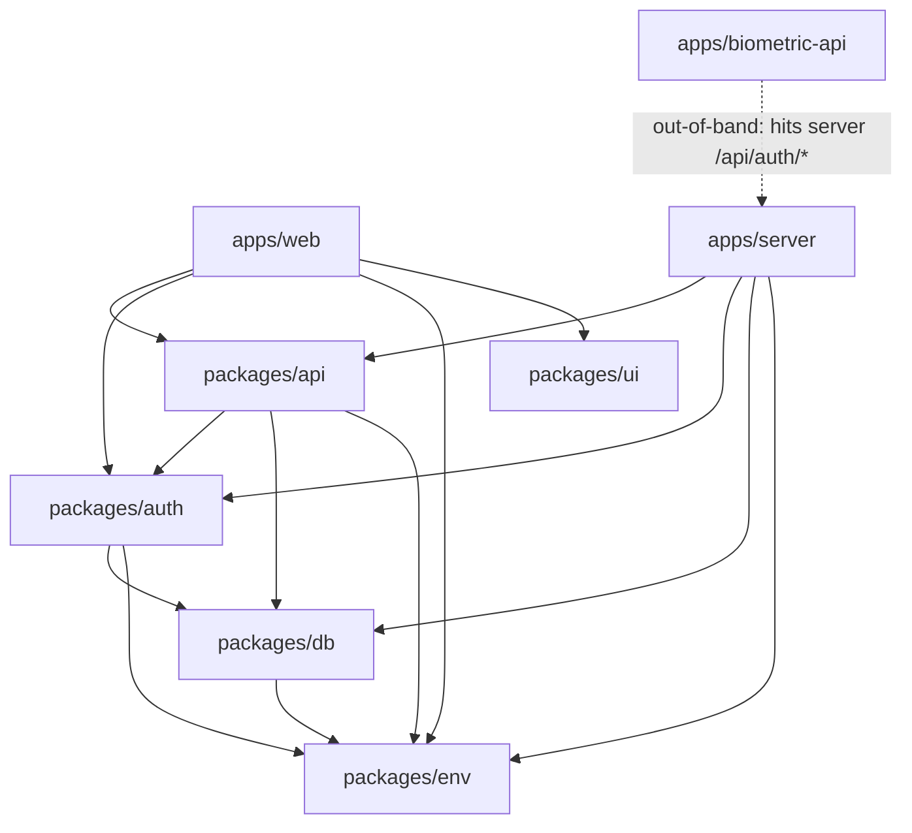
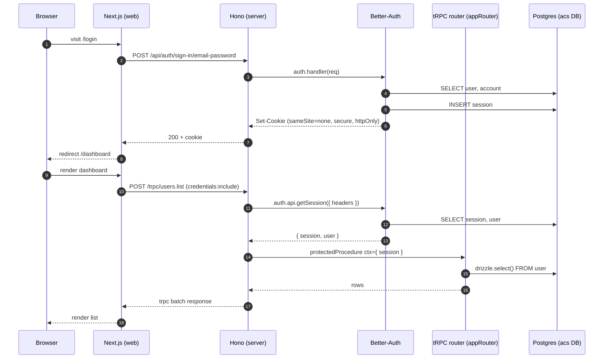
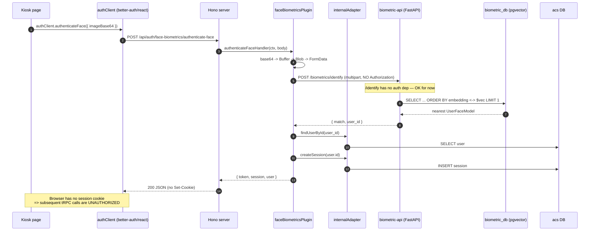
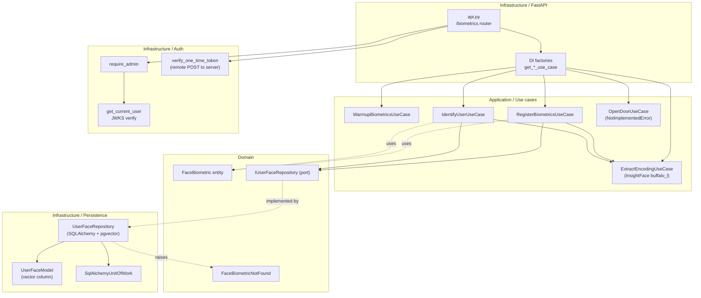
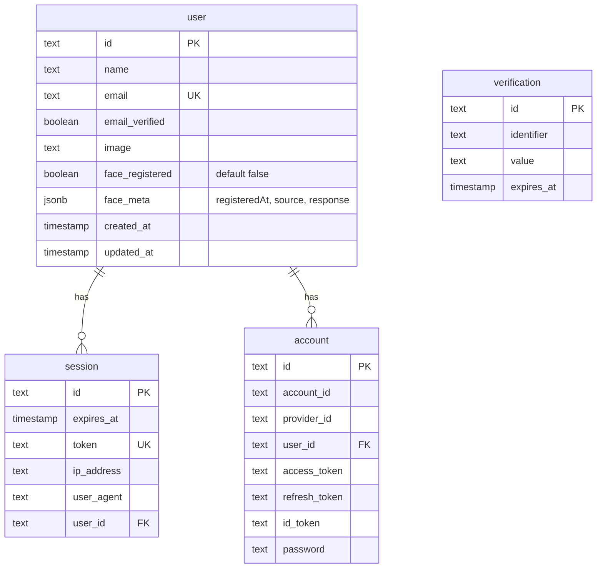

# Architecture Review — access-control-system

Whole-project review with diagrams. Scope: master @ `00cd845`, plus uncommitted working-tree changes.

---

## 1. System Context

How the three runtime services and the database fit together. Two distinct logical databases live in the same Postgres instance (pgvector-enabled).

```mermaid
graph LR
    Browser([Browser / Kiosk Device])

    subgraph Edge["Edge / Local network"]
        Web["apps/web<br/>Next.js 16<br/>:3001"]
        Server["apps/server<br/>Hono + tRPC<br/>:3000"]
        Bio["apps/biometric-api<br/>FastAPI + HexCore<br/>:8000"]
    end

    subgraph Data["Postgres 17 + pgvector (:5432)"]
        DBacs[("access-control-system<br/>Drizzle / Better-Auth")]
        DBbio[("biometric_db<br/>Alembic / SQLAlchemy")]
    end

    Browser -- "HTTP+cookies (credentials:include)" --> Web
    Web -- "/trpc/* + /api/auth/*" --> Server
    Server -- "POST /biometrics/* (multipart, no auth header)" --> Bio
    Bio -- "POST /one-time-token/verify (open-door only)" --> Server
    Bio -- "JWKS fetch (configured, not yet used at runtime)" -.-> Server

    Server -- "node-postgres (drizzle)" --> DBacs
    Bio -- "asyncpg / SQLAlchemy" --> DBbio
```

**Note:** Even though both DBs live on the same Postgres instance, they are separate logical databases. There is no FK from `biometric_db.user_face.user_id` to `access-control-system.user.id` — that referential integrity is the application's job.

---

## 2. Workspace Dependency Graph

Build-time package edges in the monorepo. `packages/config` is currently empty.



Observation: `apps/web` only imports the `AppRouter` *type* from `packages/api` — there's no runtime code crossing that boundary, which is the right shape for tRPC.

---

## 3. Request flow — email/password sign-in + tRPC query

End-to-end auth + data flow showing the cookie session that links Better-Auth and tRPC.



---

## 4. Request flow — Face authentication ("kiosk" path)

Where the system gets interesting (and where the bugs are).



**Issue 4a — Biometric login does not actually log the user in.** `createSession` writes the row but never sets the cookie, so the browser stays anonymous. The handler needs to call Better-Auth's session-cookie helper (see `setSessionCookie` / `ctx.setCookie` in better-auth) before returning, or return the token and have the client persist it explicitly.

---

## 5. Hexagonal architecture — Python biometric service

The Python sidecar follows HexCore conventions strictly. Layer boundaries are real here (use cases depend only on `IUserFaceRepository`, not on SQLAlchemy).



---

## 6. Drizzle schema (auth DB)

Better-Auth's standard tables, extended on `user` with two face-biometrics columns.



---

## 7. Findings

### Correctness

1. **Biometric authentication never sets the session cookie** ([packages/auth/src/plugins/biometric.ts:114-126](packages/auth/src/plugins/biometric.ts#L114-L126)). `internalAdapter.createSession` inserts a session row but returns JSON only — the browser has no cookie afterwards. The kiosk flow as written will leave the user unauthenticated for subsequent `/trpc/*` calls. Use Better-Auth's session-cookie helper (`setSessionCookie(ctx, session)`) before `ctx.json(...)`.

2. **Auth mismatch with the Python `/biometrics/register` endpoint** ([apps/biometric-api/src/features/biometrics/infrastructure/api.py:73-79](apps/biometric-api/src/features/biometrics/infrastructure/api.py#L73-L79)). The Python handler is guarded by `require_admin` (JWT via JWKS), but the Hono plugin POSTs without any `Authorization` header ([packages/auth/src/plugins/biometric.ts:42-46](packages/auth/src/plugins/biometric.ts#L42-L46)). Either:
   - The TS plugin must forward an admin JWT/OTT — currently it has no way to obtain one, and the Better-Auth instance has no JWT plugin enabled in [packages/auth/src/index.ts:30-32](packages/auth/src/index.ts#L30-L32); or
   - The Python endpoint should switch to validating a shared secret / OTT, since the call already crosses a trusted-network boundary (server ↔ biometric-api).

   `verify_one_time_token` is the better fit and is already implemented for the open-door endpoint — reuse it.

3. **Vector dimension comment is wrong.** `FaceBiometric.embedding` is documented as "128 dimensiones" ([apps/biometric-api/src/features/biometrics/domain/entities.py:13](apps/biometric-api/src/features/biometrics/domain/entities.py#L13)), but InsightFace's `buffalo_l` returns 512-D normed embeddings ([use_cases.py:156](apps/biometric-api/src/features/biometrics/application/use_cases.py#L156)). Misleading and will trip the next maintainer.

4. **L2 distance vs. normalized embeddings.** `UserFaceRepository.get_by_vector` uses `l2_distance` ([infrastructure/repositories.py:40](apps/biometric-api/src/features/biometrics/infrastructure/repositories.py#L40)) and there is **no threshold check** — the nearest neighbor is always returned as a match. The `IdentifyUserCommand` has a `threshold: float = 0.45` field that is silently ignored. With normed embeddings, cosine similarity (`<=>` in pgvector) is the conventional choice and you'd compare against the threshold before returning a match.

5. **Two `db` pool instances.** `packages/db/src/index.ts:10` already exports a singleton `db`, but [packages/api/src/routers/users.ts:9](packages/api/src/routers/users.ts#L9) calls `createDb()` again, opening a second pg pool. Import `db` instead.

6. **Server port is hardcoded** to `3000` in [apps/server/src/index.ts:44](apps/server/src/index.ts#L44). The Dockerfile and compose assume this, but moving it into `env` schema would be cleaner and lets the override file change it without code edits.

### Security

7. **`/biometrics/identify` is unauthenticated** ([api.py:98-101](apps/biometric-api/src/features/biometrics/infrastructure/api.py#L98)). Anyone with network access to port 8000 can submit a face image and learn the matching `user_id`. In the docker-compose dev setup the port is published to the host; in a real deployment this service should sit behind the Hono server or behind shared-secret auth.

8. **Default admin secret in compose.** [docker-compose.yml:92](docker-compose.yml#L92) ships `BETTER_AUTH_SECRET: change-me-to-a-random-32-char-secret!!`. It barely meets the 32-char Zod minimum, which means a real deployment that forgets to override it will pass validation but be effectively unsigned. Consider documenting this and refusing to start on detection of the placeholder.

9. **Face image is base64-encoded into a JSON body** ([packages/auth/src/plugins/biometric.ts:21-22](packages/auth/src/plugins/biometric.ts#L21-L22)) and re-decoded server-side. There is no size limit — a large image will be base64-inflated by ~33% in memory before being decoded into a Buffer and then into a Blob. Add a payload size cap (Zod `.max()` on the string, or check `request.headers['content-length']`).

10. **`emailVerified` defaults to `true` via `default(false)` — name is fine, but** there is no email-verification flow registered in Better-Auth, so it stays `false` forever. Either enable verification or remove the column from the SELECT in the UI to avoid implying it's meaningful.

### Conventions & quality

11. **Mixed indentation in `biometric.ts`.** `biome.json` mandates `indentStyle: "tab"`, but the biometric plugin file is 4-space-indented. `pnpm check` would catch and fix this — run it before commit.

12. **`createDb()` and `db` both exported.** Pick one. Same in `auth` (`createAuth` + `auth`). The factory is useful for tests with isolated pools; the singleton is what the apps actually use. If you don't have tests yet, drop the factory until you do.

13. **No tests anywhere in the JS/TS stack.** `apps/biometric-api/tests/` exists but appears empty too. For a system gating physical access, the identification threshold logic alone deserves a test suite.

14. **`apps/web/src/app/(admin)/admin/` and `(kiosk)/access/` are empty directories.** Either fill them or delete the route groups — empty Next.js route groups can confuse the router and the reader.

15. **`packages/api`/`auth`/`db`/`ui` have no `check-types` script** but the root `turbo check-types` task depends on it. `turbo` will treat them as no-ops, which is fine, but adding `"check-types": "tsc --noEmit"` would actually validate them. Currently only `apps/server` and `packages/ui` run typecheck.

16. **`apps/biometric-api/README.md` is a stub** ("Descripción del proyecto"). Given the complexity (HexCore + InsightFace + pgvector + Better-Auth JWKS), it's the one app that most needs documentation.

### Performance / operations

17. **`FaceEngine` warmup is correct** but single-threaded (`CPUExecutionProvider`). For multi-request kiosks consider `CUDAExecutionProvider` or at minimum a thread-pool wrapper — `engine.get(img_bgr)` is synchronous and will block the FastAPI event loop on every identify call. Wrap in `asyncio.to_thread`.

18. **Drizzle pool size and Better-Auth pool are independent.** Both `createDb()` calls hit the same `DATABASE_URL`, but each opens its own `pg.Pool`. With the duplicate from finding #5 you're at 2 pools per server instance.

19. **Docker compose `migrate` runs full `pnpm install --frozen-lockfile` inside an alpine node container on every up.** A baked migration image would shave 30-60s off cold starts.

### Architectural

20. **Cross-service concern: the biometric flow assumes the Hono server is trusted to act on behalf of a user.** Right now there is no mutual auth between Hono and FastAPI — they trust each other by network. The OTT plumbing in `dependencies.py` exists for the door-opening case but isn't applied to register/identify. The minimal good shape: Hono mints an OTT (one Better-Auth call) and passes it via `X-Better-Auth-One-Time-Token` to FastAPI; FastAPI calls back to verify it.

21. **Symmetry between server/client biometric plugins is good** — `faceBiometricsClientPlugin.$InferServerPlugin` gives the React client typed actions for all three endpoints with no duplication. Keep this pattern when you add more plugins.

22. **The `face_meta` jsonb column stores a snapshot of the biometric API response.** Useful for debugging, but means PII (face vector counts, etc.) lives in two databases. Either treat it as ephemeral debugging info or move it to a `face_registration_event` audit table.

---

## 8. Suggested next steps (in order)

1. Fix the session-cookie bug in `authenticateFaceHandler` — the kiosk flow does not currently log anyone in.
2. Decide on the Hono ↔ FastAPI trust model. The OTT path is half-built and is the cheapest correct option.
3. Add a similarity threshold gate to `IdentifyUserUseCase`. Without it, "identify" always succeeds against the nearest stranger.
4. `pnpm check` over the whole repo to fix indentation and import sorting; uncommitted changes have inconsistent formatting.
5. Backfill `check-types` scripts on the workspace packages so Turbo's typecheck graph is meaningful.
6. Write at least one integration test that runs `identify` against a known-bad face and asserts no match — this is the highest-risk codepath in the system.
