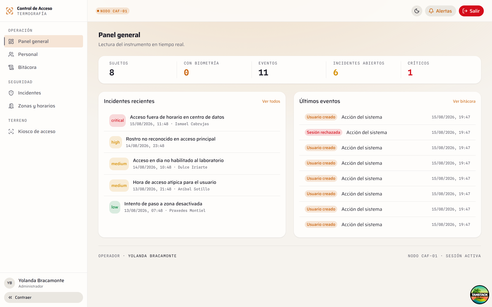
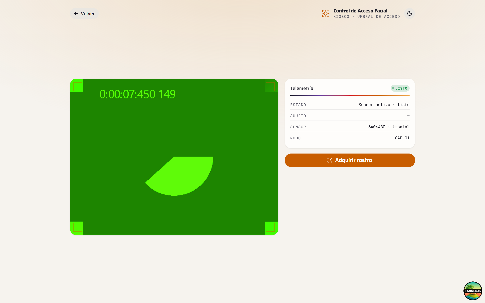
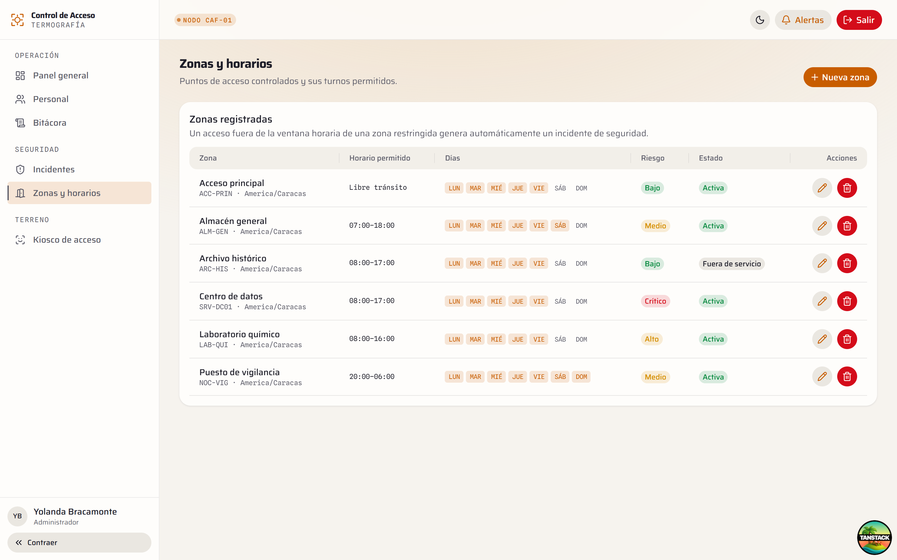
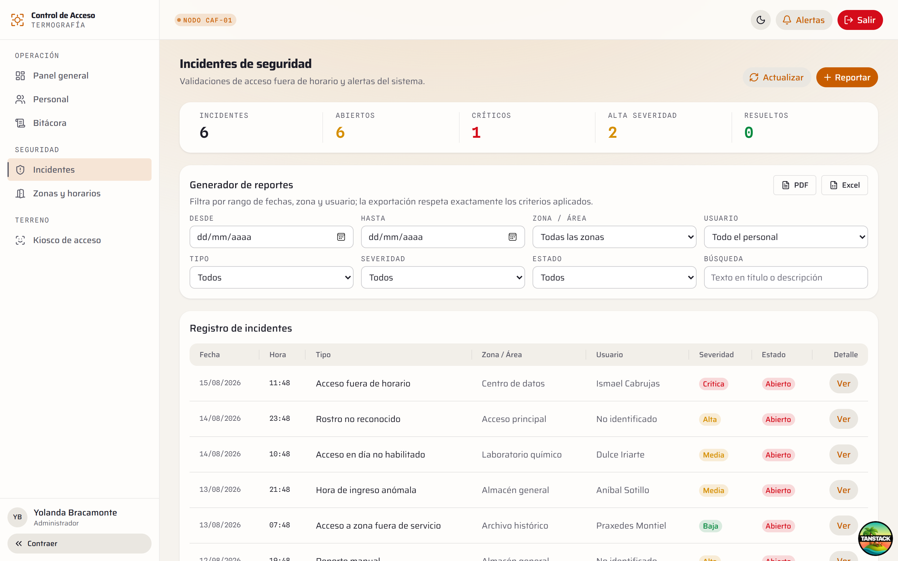
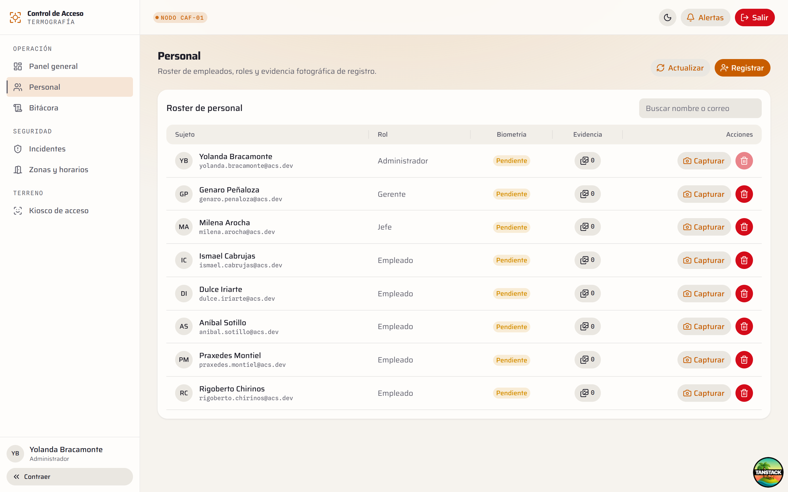
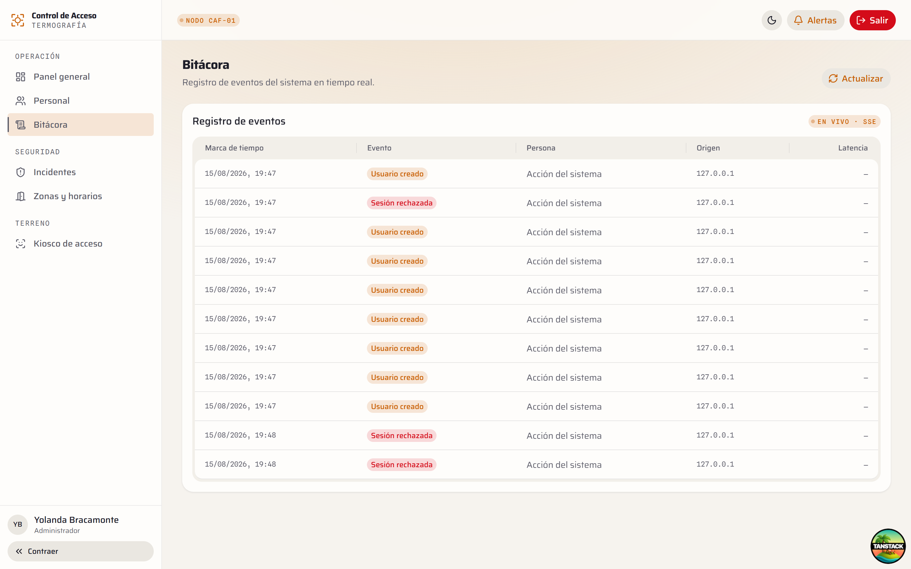
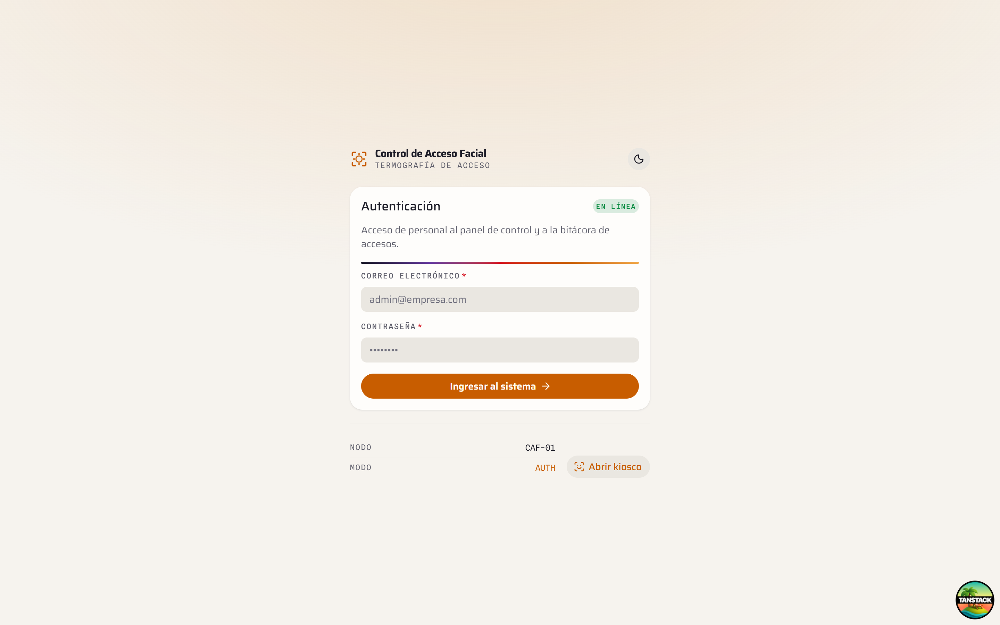
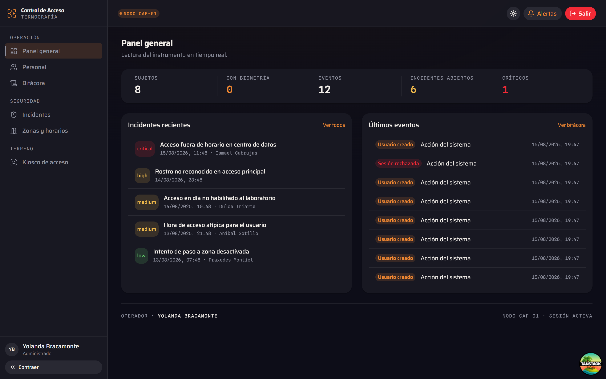
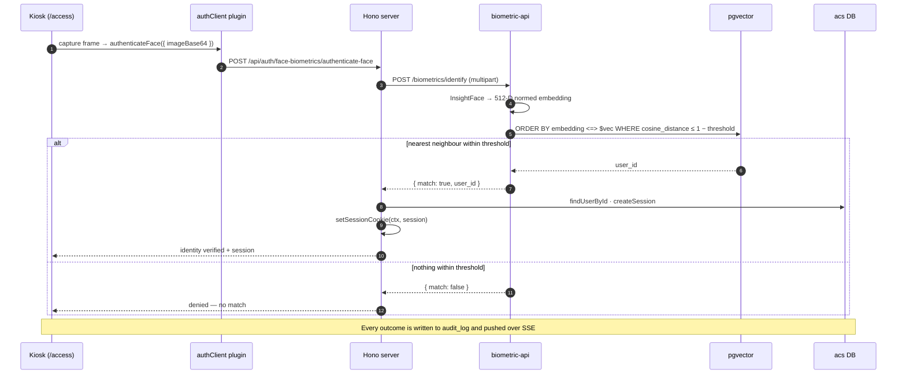
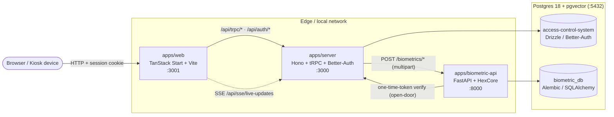

<div align="center">

# Control de Acceso Facial — Biometric Physical Access Control

**Your face is the credential.** A camera at the door identifies an enrolled employee against a pgvector similarity index, decides whether they may pass *here and now*, and writes every attempt to a live audit trail.

Three services: a TanStack Start SPA (admin console + door kiosk), a Hono/tRPC server with Better-Auth, and a FastAPI biometric engine running InsightFace over pgvector.

<br />


</div>

---

## What this is

Badges get lent, PINs get shared, phones get lost. This system replaces all of
them with the one credential an employee cannot hand to someone else.

An employee is enrolled once through a guided **multi-pose capture** — front,
right, left — with on-device pose detection that fires the shutter only when the
head is actually in position. InsightFace turns each frame into a 512-dimension
normed embedding, stored in Postgres via **pgvector**.

At the door, a wall-mounted kiosk takes a frame and asks one question: *who is
this?* The answer is a cosine-similarity nearest-neighbour search **gated by a
confidence threshold** — below it, there is no match, and "no match" is a
first-class outcome rather than an error. Above it, the system knows who is
standing there, and can then ask the second question: *is this person allowed in
this zone, on this day, at this hour?*

Everything — matches, failures, enrolments, door events — lands in an audit log
the operator watches update live over SSE.

> [!IMPORTANT]
> **The door relay is not implemented yet.** On a successful match the kiosk
> reports *identity verified*, explicitly stating that the physical actuation is
> pending. The UI is deliberately built to tell that truth rather than fake a
> door it cannot open.

---

## Screenshots

Real captures of the running stack with seeded demo data. Details in the
[screenshot notes](docs/screenshots/README.md).

### Operations panel

Subjects, biometric-enrolment coverage, event volume and open incidents, with a
live incident list and an event feed that updates over SSE.



### The door kiosk

Full-screen station for a wall-mounted tablet: live viewfinder, sensor telemetry
and a single capture action. The feed shown is a **synthetic test camera** — the
capture host had no physical webcam.



### Security model

<table>
<tr>
<td width="50%"></td>
<td width="50%"></td>
</tr>
<tr>
<td align="center"><em>Zones — risk level and permitted day/time window</em></td>
<td align="center"><em>Incidents by type and severity</em></td>
</tr>
<tr>
<td width="50%"></td>
<td width="50%"></td>
</tr>
<tr>
<td align="center"><em>Personnel with role and enrolment status</em></td>
<td align="center"><em>Live audit log</em></td>
</tr>
</table>

### Light and dark

<table>
<tr>
<td width="50%"></td>
<td width="50%"></td>
</tr>
</table>

---

## How identification works



**The threshold is the whole safety story.** A nearest-neighbour search always
returns *someone*; without a distance gate, an unknown face would be identified
as whoever happens to be closest in vector space. The repository applies
`cosine_distance ≤ 1 − threshold` in SQL, so a stranger returns no rows rather
than the nearest stranger.

### Enrolment

A guided capture in the admin console asks for three poses — **front, right,
left**. MediaPipe Tasks Vision runs pose detection in the browser and
auto-captures when the head is correctly oriented, so the operator never has to
judge the moment. The frames are posted to `register-face`; each becomes its own
embedding row, which is what makes later identification robust to head angle.

---

## Zones, schedules and incidents

Identity answers *who*. Zones answer *whether they may*.

Each zone carries a risk level (`low` → `critical`), a `restricted` flag, and an
access window stored as **minutes from local midnight** plus a set of permitted
weekdays. Storing minutes rather than clock times is what lets a night-shift
window legitimately cross midnight (`allowedFromMinute > allowedToMinute`), and
every zone carries its own IANA timezone.

When an attempt violates the policy, the system raises a typed incident:

| Incident type | Raised when |
| --- | --- |
| `off_hours_access` | Attempt outside the zone's permitted window |
| `restricted_day_access` | Attempt on a weekday the zone does not allow |
| `inactive_zone_access` | Attempt against a deactivated zone |
| `anomalous_login_hour` | The hour deviates from the person's own historical pattern |
| `unrecognized_face` | No embedding within the similarity threshold |
| `manual_report` | Raised by a supervisor from the panel |

Incidents carry severity, status, snapshots of the user and zone names (so the
record stays readable if either is later renamed), acknowledgement metadata and
resolution notes.

### Anomalous-hour detection with circular statistics

`anomalous_login_hour` is not a naïve "outside 9-to-5" rule. Hours are angles on
a 24-hour circle, so the service maps each historical access hour to an angle,
computes the **mean resultant vector** — giving both a mean hour and a
concentration measure `R` — and scores the new attempt as a deviation from that
von Mises-style distribution.

That matters because arithmetic averages are wrong on a circle: the mean of
23:00 and 01:00 is midnight, not noon. The service also refuses to judge when it
lacks evidence, returning `insufficient_history` below a minimum sample count
and staying silent when `R` shows the person has no consistent pattern to
deviate from.

---

## Roles

| Role | Purpose |
| --- | --- |
| `admin` | Full console: personnel, enrolment, zones, incidents, audit |
| `gerente` | Management oversight; receives push security alerts |
| `jefe` | Supervisory; receives push security alerts, may raise incidents |
| `user` (empleado) | Does not log in — is identified at the door |

`admin`, `gerente` and `jefe` can subscribe to **Web Push** security alerts.
Administrators cannot be deleted.

---

## Architecture



Two **separate logical databases** live in the same pgvector-enabled Postgres
instance. There is deliberately no foreign key from `biometric_db.user_face.user_id`
to the auth database's `user.id` — keeping face vectors in their own database
means the biometric store can be isolated, backed up and access-controlled
independently. Referential integrity across that boundary is the application's
job.

### The Better-Auth biometric plugin

Face operations are exposed as a first-class Better-Auth plugin rather than
bolted-on routes, which gives the React client fully typed actions with no
duplication (`$InferServerPlugin`):

| Endpoint | Purpose |
| --- | --- |
| `POST /api/auth/face-biometrics/register-face` | Enrol captured poses for a user |
| `POST /api/auth/face-biometrics/authenticate-face` | Identify and open a session |
| `POST /api/auth/face-biometrics/search-user-by-face` | Identify without signing in |

---

## Tech stack

<table>
<tr><th align="left">Layer</th><th align="left">Choices</th></tr>
<tr>
<td><b>Frontend</b><br /><code>apps/web</code></td>
<td>React 19 · <b>TanStack Start</b> + Router + Query · <b>HeroUI v3</b> · Tailwind CSS v4 · <b>MediaPipe Tasks Vision</b> (in-browser pose detection) · Better-Auth client · Vite · Vitest</td>
</tr>
<tr>
<td><b>Server</b><br /><code>apps/server</code></td>
<td><b>Hono</b> · <b>tRPC</b> · <b>Better-Auth</b> (admin plugin + custom biometric plugin) · <b>Drizzle ORM</b> · SSE · Web Push (VAPID)</td>
</tr>
<tr>
<td><b>Biometrics</b><br /><code>apps/biometric-api</code></td>
<td><b>Python 3.14</b> · <b>FastAPI</b> · <b>HexCore</b> (hexagonal/DDD) · <b>InsightFace</b> (buffalo_l) · <b>ONNX Runtime</b> · OpenCV · <b>pgvector</b> · SQLAlchemy + Alembic · PyJWT (JWKS)</td>
</tr>
<tr>
<td><b>Data</b></td>
<td>PostgreSQL 18 with the <code>pgvector</code> extension — two logical databases</td>
</tr>
<tr>
<td><b>Tooling</b></td>
<td>Turborepo · pnpm workspaces · <b>Biome</b> · Docker Compose</td>
</tr>
</table>

---

## Repository structure

```
access-control-system/
├── apps/
│   ├── web/             # TanStack Start SPA — admin panel + door kiosk
│   ├── server/          # Hono + tRPC + Better-Auth + SSE + Web Push
│   └── biometric-api/   # FastAPI — InsightFace, pgvector, anomaly detection
├── packages/
│   ├── api/             # tRPC routers (users, audit, security, door, notifications)
│   ├── auth/            # Better-Auth config + face-biometrics plugin
│   ├── db/              # Drizzle schema (auth, audit, security, media, notifications)
│   ├── env/             # Zod-validated environment
│   └── config/          # Shared config
├── docs/
│   ├── diagramas/
│   └── screenshots/
├── ARCHITECTURE.md      # Architecture review with diagrams and findings
├── PRODUCT.md           # Product brief: users, purpose, principles
├── DESIGN.md            # Design system
└── DOCKER_DEV.md        # Docker development guide
```

The biometric service is documented in **[`apps/biometric-api/README.md`](apps/biometric-api/README.md)**.

---

## Running it

```bash
docker compose -f docker-compose.local.yml up -d --build
```

Brings up pgvector-enabled Postgres, both migration jobs (Drizzle then Alembic),
the Hono server, the SPA and the biometric API.

| Service | URL |
| --- | --- |
| Web app | http://localhost:3001 |
| Server (tRPC + auth) | http://localhost:3000 |
| Biometric API docs | http://localhost:8000/docs |
| PostgreSQL | `localhost:5432` |

**First run:** the app detects an empty system and offers a guarded first-run
flow that creates the root administrator using `ADMIN_SETUP_SECRET`. The endpoint
refuses once any user exists, so it cannot be replayed later.

The kiosk needs camera permission and a secure context — `localhost` counts as
secure, so it works in local development without TLS.

### Local development

```bash
pnpm install
pnpm run dev                                  # web + server
cd apps/biometric-api && uv sync && fastapi dev main.py
```

### Scripts

| Command | Does |
| --- | --- |
| `pnpm run dev` | Start web + server |
| `pnpm run build` | Build all JS apps |
| `pnpm run check-types` | Type-check the workspace |
| `pnpm run check` | Biome format + lint fix |
| `pnpm run db:push` / `db:generate` / `db:migrate` / `db:studio` | Drizzle workflow |

---

## Known gaps

This project ships with an honest self-review in
[`ARCHITECTURE.md`](ARCHITECTURE.md). The two headline correctness findings from
that review — the biometric login not setting a session cookie, and
identification having no similarity threshold — **have since been fixed** in the
code (`setSessionCookie` is called; the repository gates on cosine distance).
The following remain open and are worth knowing before deploying:

- **The door relay is unimplemented.** The system verifies identity; it does not
  yet actuate hardware.
- **`/biometrics/identify` is unauthenticated.** Anyone who can reach port 8000
  can submit a face and learn the matching user id. It must sit behind the Hono
  server or shared-secret auth in any real deployment — do not publish that port.
- **Server ↔ biometric-api trust is network-level only.** The one-time-token
  plumbing exists for the door endpoint but is not applied to register/identify.
- **Face payloads have no size cap.** Images arrive base64-encoded in a JSON body
  and are inflated ~33% in memory before decoding.
- **InsightFace runs synchronously** on the CPU execution provider, blocking the
  FastAPI event loop per identify call. Wrap in `asyncio.to_thread` before
  putting more than one kiosk on it.

---

## Privacy note

This system stores biometric templates — in many jurisdictions a special
category of personal data. The embeddings are not reversible to a photograph,
but they are still biometric identifiers: deploying this for real means
obtaining informed consent, defining a retention and deletion policy, and
isolating the biometric database accordingly.

---

## License

Released under the [MIT License](LICENSE).
