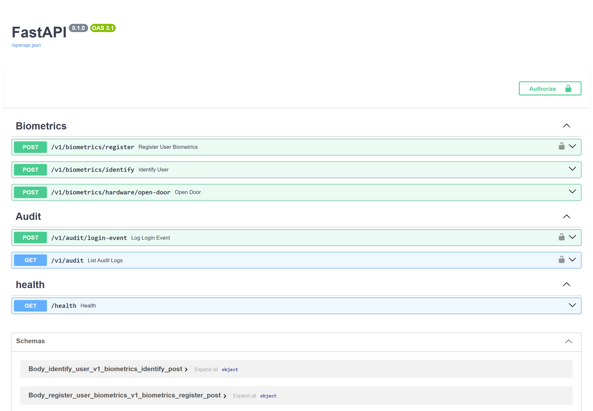

<div align="center">

# Biometric API — FastAPI + InsightFace + pgvector

**The face engine behind [Control de Acceso Facial](../../README.md):** turns a camera frame into a 512-dimension embedding, searches it against enrolled faces with a threshold-gated cosine similarity, and flags anomalous access hours using circular statistics.


</div>

---

## What this service does

Three things, and nothing else — identity, evidence and anomaly:

1. **Enrol** — accept the captured poses of a person, extract one 512-D normed
   embedding per frame, and persist them atomically against a user id.
2. **Identify** — extract an embedding from a single frame and find the nearest
   enrolled face **within a similarity threshold**, or report no match.
3. **Judge** — score whether an access hour is anomalous for that person, and
   record the audit evidence.

It holds no session state and no user profiles. Authentication, roles and the UI
live in the Hono server ([`apps/server`](../server)); this service is reached
through it.



---

## Architecture

Hexagonal / DDD via **HexCore**, organised as vertical slices. The layer
boundaries are real: use cases depend on `IUserFaceRepository`, never on
SQLAlchemy.

```
src/
├── features/
│   ├── biometrics/      ← Enrolment, embedding extraction, 1:N identification
│   ├── anomaly/         ← Circular-statistics access-hour detection
│   └── audit/           ← Evidence trail
└── shared/
    ├── infrastructure/auth/       ← JWKS / JWT, one-time-token verification
    └── infrastructure/database/   ← Async SQLAlchemy + pgvector session
```

Each slice keeps the same three layers — `domain/` (entities, ports, services),
`application/` (use cases, DTOs), `infrastructure/` (routes, models,
repositories, notifiers).

---

## The face pipeline

### Embedding extraction

`ExtractEncodingUseCase` decodes the uploaded bytes to a BGR image and runs the
shared `FaceEngine` singleton (InsightFace `buffalo_l` over ONNX Runtime):

- **No face detected** → `400` with an actionable message, not a silent failure.
  A person standing badly lit at a door is an expected outcome.
- **Multiple faces** → the highest `det_score` wins, i.e. the subject closest to
  the camera rather than a bystander in the background.
- The vector used is `normed_embedding` — **512 dimensions**, L2-normalised,
  which is what makes cosine similarity the right comparison.

> The `FaceBiometric` entity's docstring still says "128 dimensiones", a leftover
> from an earlier face-recognition backend. The real width is 512.

### Identification — the threshold is the safety property

```python
max_cosine_distance = 1.0 - threshold          # threshold defaults to 0.45
stmt = (
    select(UserFaceModel)
    .where(UserFaceModel.embedding.cosine_distance(embedding) <= max_cosine_distance)
    .order_by(UserFaceModel.embedding.cosine_distance(embedding))
)
```

The `WHERE` clause is the point. A nearest-neighbour query on its own **always**
returns a row — without the distance gate, an unknown face would be identified
as whoever sits closest in vector space, which for a system that opens doors is
the worst possible failure mode. With the gate, a stranger returns nothing and
`IdentifyUserUseCase` reports `match: false`.

Enrolling several poses per person means several rows per user, so a head turned
at the door still lands near *one* of that person's vectors.

---

## Anomalous access hours (circular statistics)

`LoginTimePatternService` decides whether an access hour is unusual **for that
individual**, not against a fixed office schedule.

Clock hours are angular: the arithmetic mean of 23:00 and 01:00 is midday, which
is nonsense. So each historical hour is mapped to an angle on a 24-hour circle
and the service computes the mean resultant vector:

```
angle_i = (hour_i mod 24) / 24 · 2π
C = (1/n) Σ cos(angle_i)      S = (1/n) Σ sin(angle_i)
R = hypot(C, S)               mean_hour = atan2(S, C) → hours
```

`R` ∈ [0,1] is the **concentration**: near 1 the person is highly regular, near 0
their history is scattered around the clock. From it the service derives a
circular standard deviation and scores the new attempt as a deviation, guarded at
both ends:

- fewer than `min_samples` observations → `insufficient_history`, never suspicious;
- `R` below `min_r` → no usable pattern, so no accusation;
- a sigma floor prevents a division blow-up when `R → 1` (a perfectly regular
  person would otherwise have σ → 0 and every attempt would look infinitely
  anomalous).

The result is that the system only cries wolf when it has both enough history and
a genuinely concentrated pattern to deviate from.

---

## Endpoints

| Method | Path | Purpose |
| --- | --- | --- |
| `POST` | `/biometrics/register` | Enrol captured frames for a user id |
| `POST` | `/biometrics/identify` | 1:N identification against the vector index |
| `POST` | `/biometrics/hardware/open-door` | Door actuation, guarded by a one-time token |
| `GET` | `/audit` | Evidence trail |

Interactive OpenAPI docs at **http://localhost:8000/docs**.

> [!WARNING]
> **`/biometrics/identify` is currently unauthenticated.** Anyone able to reach
> port 8000 can submit a face image and learn the matching `user_id`. In the dev
> compose file that port is published to the host; in any real deployment this
> service must sit behind the Hono server or behind shared-secret auth, and the
> port must not be exposed. `/biometrics/register` is guarded by `require_admin`
> (JWT via JWKS), while the door endpoint uses one-time-token verification —
> that same OTT mechanism is the intended fix for the other two.

---

## Data

Lives in its own logical database (`biometric_db`), separate from the auth
database even though both run on the same Postgres instance:

| Table | Holds |
| --- | --- |
| `user_face` | `user_id`, `embedding vector(512)`, metadata — one row per enrolled pose |

There is deliberately **no foreign key** to the auth database's `user` table:
keeping biometric templates in their own database lets them be isolated, backed
up and access-controlled on their own terms. The application maintains that
referential integrity.

---

## Getting started

```bash
cd apps/biometric-api
uv sync

alembic upgrade head
fastapi dev main.py          # :8000
```

On first start the engine downloads the InsightFace `buffalo_l` model pack and
warms it up, so the first boot is noticeably slower than later ones. In Docker
the models are cached in a named volume.

### Configuration

| Variable | Purpose |
| --- | --- |
| `DATABASE_URL` / `SQL_DATABASE_URL` | Sync URLs (Alembic, SQLAlchemy) |
| `ASYNC_SQL_DATABASE_URL` | Async URL (asyncpg) |
| `BETTER_AUTH_URL` | Auth server base URL (internal) |
| `BETTER_AUTH_ISSUER` / `BETTER_AUTH_AUDIENCE` | JWT claims validated on admin routes |
| `JWKS_URL` | Public keys for RS256 verification |
| `INTERNAL_API_KEY` | Shared secret for server-to-server calls |

### Tests

```bash
pytest
```

---

## Known limitations

- **Synchronous inference.** `engine.get(img_bgr)` runs on the
  `CPUExecutionProvider` and blocks the FastAPI event loop for the duration of
  every identify call. Wrap it in `asyncio.to_thread` (or move to
  `CUDAExecutionProvider`) before serving more than one kiosk.
- **No mutual auth with the Hono server.** The two services currently trust each
  other by network position; the one-time-token path is half-built.
- **No size cap on uploads.** Large frames are decoded fully into memory.
- **Threshold is a default, not a policy.** `0.45` is the code default; a real
  deployment should tune it against a measured false-accept / false-reject curve
  for its own population and camera, and that decision deserves a test suite —
  this is the component that opens doors.

---

## Related

- [Root README](../../README.md) — product overview, screenshots, running the stack
- [`ARCHITECTURE.md`](../../ARCHITECTURE.md) — full architecture review with diagrams and findings
- [`apps/server`](../server) — Hono, tRPC, Better-Auth and the face-biometrics plugin
- [`apps/web`](../web) — admin console and door kiosk

## License

MIT — see [LICENSE](../../LICENSE) at the repository root.
