# Diagrama Morfológico — access-control-system

Descomposición jerárquica del sistema. El nodo raíz se desglosa en subsistemas, módulos y unidades funcionales. Cada hoja corresponde a un componente físico (archivo / paquete / endpoint).

```mermaid
graph TD
    ROOT["access-control-system<br/><i>Sistema de Control de Acceso<br/>Biométrico</i>"]

    %% Nivel 1: Subsistemas
    ROOT --> S1["1. Subsistema Frontend<br/>(apps/web)"]
    ROOT --> S2["2. Subsistema Backend<br/>(apps/server)"]
    ROOT --> S3["3. Subsistema Biométrico<br/>(apps/biometric-api)"]
    ROOT --> S4["4. Subsistema de Persistencia<br/>(packages/db + Postgres)"]
    ROOT --> S5["5. Subsistema de Autenticación<br/>(packages/auth + Better-Auth)"]
    ROOT --> S6["6. Subsistema de UI compartida<br/>(packages/ui)"]
    ROOT --> S7["7. Subsistema de Infraestructura<br/>(Docker, Turbo, pnpm)"]

    %% Frontend
    S1 --> S1A["1.1 Enrutador Next.js"]
    S1A --> S1A1["Route Group (admin)"]
    S1A --> S1A2["Route Group (kiosk)"]
    S1A --> S1A3["Ruta /dashboard"]
    S1A --> S1A4["Ruta /login"]
    S1A --> S1A5["Ruta / (home)"]
    S1 --> S1B["1.2 Componentes de presentación"]
    S1B --> S1B1["sign-in-form"]
    S1B --> S1B2["sign-up-form"]
    S1B --> S1B3["header / user-menu"]
    S1B --> S1B4["mode-toggle"]
    S1B --> S1B5["loader"]
    S1 --> S1C["1.3 Clientes de datos"]
    S1C --> S1C1["trpc client + QueryClient"]
    S1C --> S1C2["authClient (Better-Auth React)"]
    S1C --> S1C3["faceBiometricsClientPlugin"]
    S1 --> S1D["1.4 Captura de cámara"]
    S1D --> S1D1["camera-capture component"]
    S1D --> S1D2["useCamera hook"]

    %% Backend
    S2 --> S2A["2.1 Servidor Hono"]
    S2A --> S2A1["Middleware cors"]
    S2A --> S2A2["Middleware logger"]
    S2A --> S2A3["Handler /api/auth/*"]
    S2A --> S2A4["Handler /trpc/*"]
    S2A --> S2A5["Health GET /"]
    S2 --> S2B["2.2 Router tRPC<br/>(packages/api)"]
    S2B --> S2B1["publicProcedure"]
    S2B --> S2B2["protectedProcedure"]
    S2B --> S2B3["healthCheck"]
    S2B --> S2B4["privateData"]
    S2B --> S2B5["users.list"]
    S2B --> S2B6["users.delete"]

    %% Biométrico (HexCore)
    S3 --> S3A["3.1 Capa Infraestructura"]
    S3A --> S3A1["/biometrics/register"]
    S3A --> S3A2["/biometrics/identify"]
    S3A --> S3A3["/biometrics/hardware/open-door"]
    S3A --> S3A4["UserFaceRepository (SQLAlchemy)"]
    S3A --> S3A5["Auth deps (JWKS, OTT)"]
    S3 --> S3B["3.2 Capa Aplicación"]
    S3B --> S3B1["WarmupBiometricsUseCase"]
    S3B --> S3B2["ExtractEncodingUseCase"]
    S3B --> S3B3["RegisterBiometricsUseCase"]
    S3B --> S3B4["IdentifyUserUseCase"]
    S3B --> S3B5["OpenDoorUseCase"]
    S3 --> S3C["3.3 Capa Dominio"]
    S3C --> S3C1["FaceBiometric (entidad)"]
    S3C --> S3C2["IUserFaceRepository (puerto)"]
    S3C --> S3C3["FaceBiometricNotFound (excepción)"]
    S3 --> S3D["3.4 Motor de IA"]
    S3D --> S3D1["FaceEngine (InsightFace)"]
    S3D --> S3D2["Modelo buffalo_l (ONNX)"]

    %% Persistencia
    S4 --> S4A["4.1 BD access-control-system"]
    S4A --> S4A1["Tabla user"]
    S4A --> S4A2["Tabla session"]
    S4A --> S4A3["Tabla account"]
    S4A --> S4A4["Tabla verification"]
    S4 --> S4B["4.2 BD biometric_db"]
    S4B --> S4B1["Tabla user_faces (pgvector)"]
    S4 --> S4C["4.3 Migraciones"]
    S4C --> S4C1["Drizzle Kit (push)"]
    S4C --> S4C2["Alembic (versions)"]

    %% Autenticación
    S5 --> S5A["5.1 Better-Auth instance"]
    S5A --> S5A1["Drizzle adapter"]
    S5A --> S5A2["emailAndPassword"]
    S5A --> S5A3["faceBiometricsPlugin"]
    S5 --> S5B["5.2 Endpoints face-biometrics"]
    S5B --> S5B1["register-face"]
    S5B --> S5B2["authenticate-face"]
    S5B --> S5B3["search-user-by-face"]

    %% UI compartida
    S6 --> S6A["6.1 Primitivas HeroUI"]
    S6A --> S6A1["button, card, input, label"]
    S6A --> S6A2["checkbox, dropdown-menu"]
    S6A --> S6A3["skeleton, sonner"]
    S6 --> S6B["6.2 Hooks compartidos"]
    S6B --> S6B1["use-camera"]
    S6 --> S6C["6.3 Estilos globales"]
    S6C --> S6C1["globals.css (tokens)"]

    %% Infra
    S7 --> S7A["7.1 Docker Compose"]
    S7A --> S7A1["postgres (pgvector)"]
    S7A --> S7A2["migrate (Drizzle)"]
    S7A --> S7A3["biometric-migrate (Alembic)"]
    S7A --> S7A4["server, web, biometric-api"]
    S7 --> S7B["7.2 Turborepo pipelines"]
    S7 --> S7C["7.3 pnpm workspaces + catalog"]
    S7 --> S7D["7.4 Biome (lint + format)"]
```

## Nomenclatura

| Nivel | Tipo | Ejemplo |
|-------|------|---------|
| 0 | Sistema | access-control-system |
| 1 | Subsistema | Frontend, Backend, Biométrico… |
| 2 | Módulo | Enrutador Next.js, Router tRPC, Capa Aplicación |
| 3 | Unidad funcional | `users.list`, `IdentifyUserUseCase`, tabla `user` |
