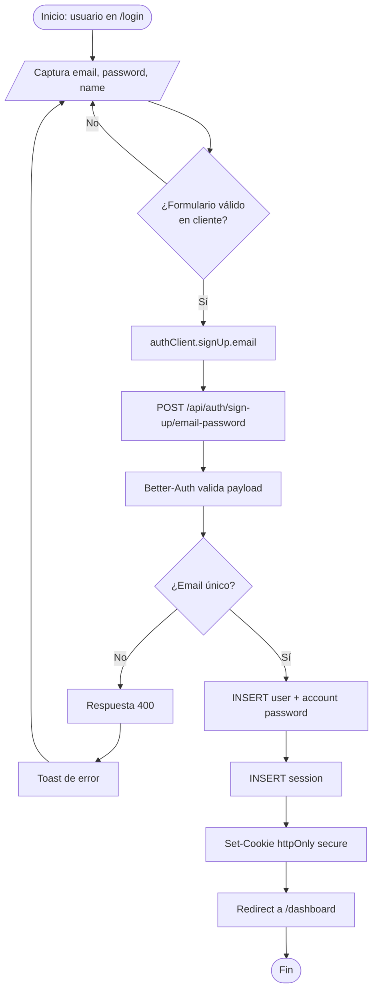
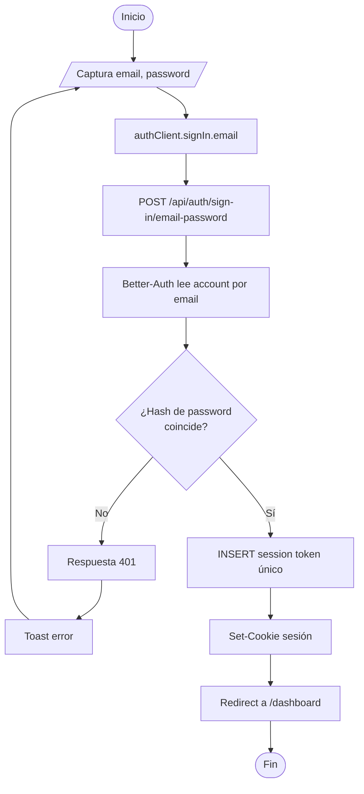
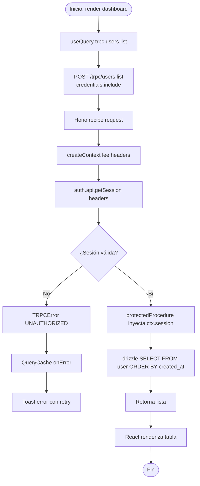
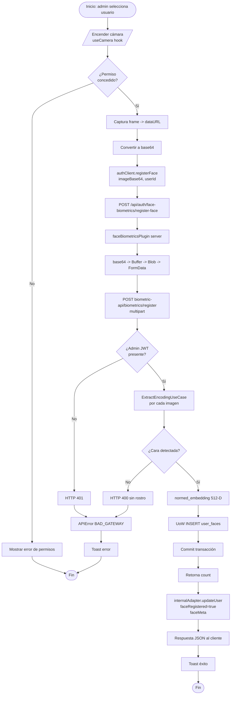
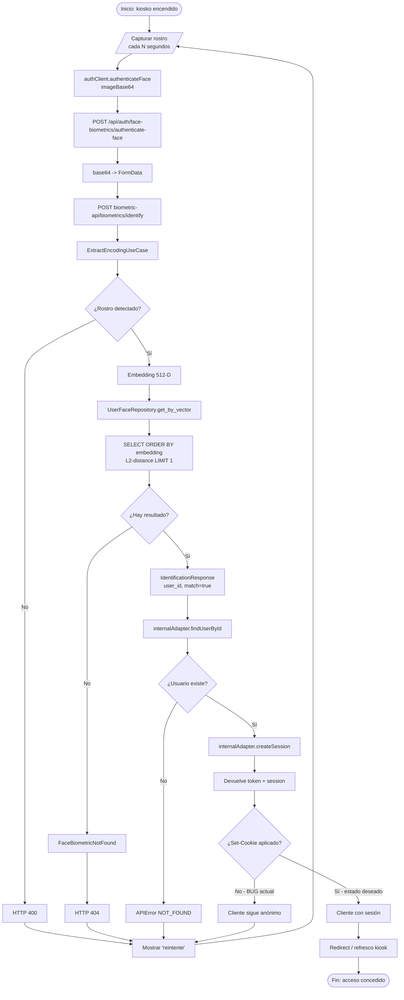
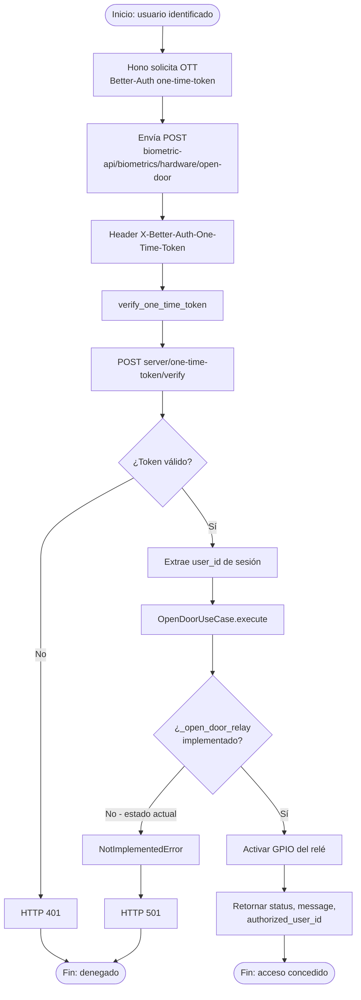
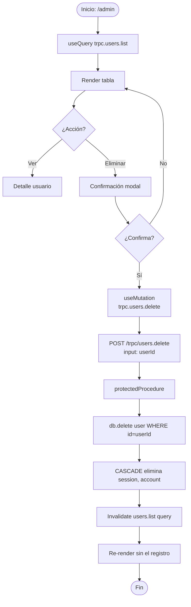
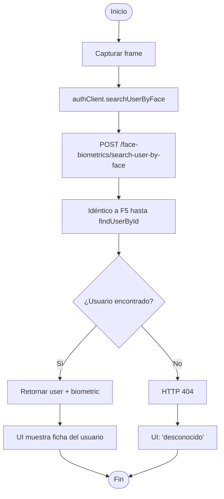
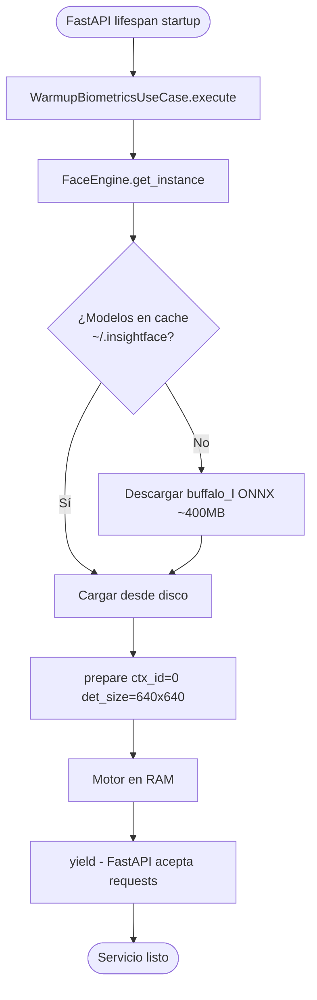

# Diagramas de Flujo — access-control-system

Un flujograma por cada caso de uso real del sistema. Notación: rombos = decisiones, rectángulos redondeados = inicio/fin, rectángulos = procesos, paralelogramos = E/S.

---

## F1. Registro de usuario (email + contraseña)

---

## F2. Login con email + contraseña

---

## F3. Consumo de tRPC autenticado (ej. `users.list`)

---

## F4. Registro biométrico facial (admin)

---

## F5. Autenticación biométrica (kiosk)

---

## F6. Apertura de puerta (relé) protegida por OTT

---

## F7. Listado y eliminación de usuarios (admin)

---

## F8. Búsqueda de usuario por rostro (sin login)

Variante de F5 que no crea sesión — útil para pantallas de información.

---

## F9. Inicialización del motor de IA (startup)

