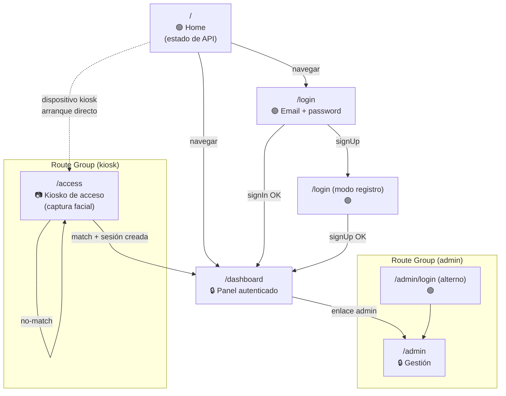
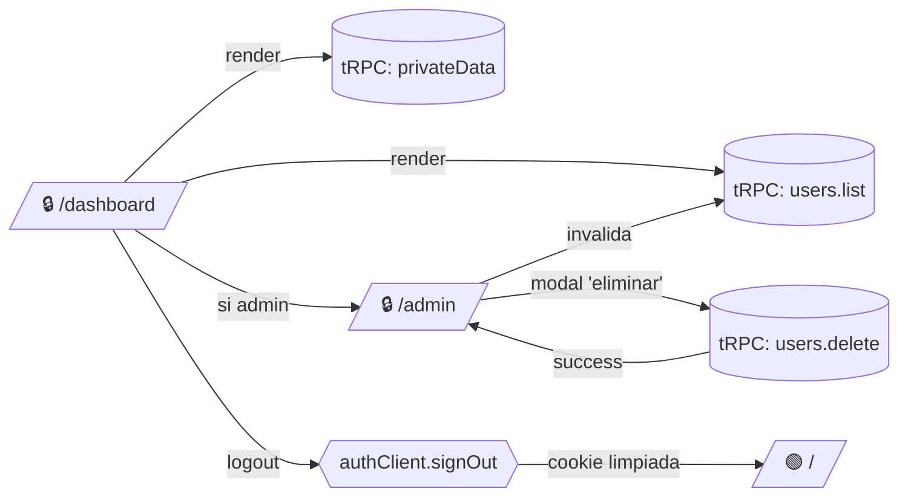

# Mapa de Navegación — access-control-system (frontend)

Representa las rutas de la aplicación Next.js (`apps/web`), agrupadas por *route group* y con sus transiciones. Convenciones:

- 🟢 = ruta pública (no requiere sesión).
- 🔒 = ruta protegida (redirige a `/login` si no hay sesión).
- 📷 = ruta de kiosko (no requiere sesión interactiva — autentica por rostro).
- Las llamadas a tRPC/Better-Auth se muestran al lado de la ruta que las dispara.

---

## 1. Mapa global (jerárquico)



---

## 2. Detalle por sección

### 2.1 Sección pública

```mermaid
flowchart LR
    A[/"🟢 / (home)"/]
    B[/"🟢 /login"/]

    A -->|botón 'iniciar sesión'| B
    A -->|tRPC healthCheck| A_API[(tRPC: healthCheck)]

    B -->|tab 'sign in'| B1{{authClient.signIn.email}}
    B -->|tab 'sign up'| B2{{authClient.signUp.email}}

    B1 -->|200 Set-Cookie| D[("🔒 /dashboard")]
    B2 -->|200 Set-Cookie| D
    B1 -->|401| B
    B2 -->|400 (email tomado)| B
```

### 2.2 Sección autenticada (`/dashboard`)



### 2.3 Sección kiosko (`/access`)

```mermaid
flowchart LR
    K[/"📷 /access"/]

    K -->|useCamera permite| K_CAM["camera-capture<br/>encendida"]
    K_CAM -->|loop cada N seg| K_SNAP[Captura frame]
    K_SNAP --> K_ACT{{authClient.authenticateFace}}
    K_ACT -->|match + cookie OK| DASH[/"🔒 /dashboard"/]
    K_ACT -->|404 no-match| K_RETRY[UI 'reintente'] --> K_SNAP
    K_ACT -->|400 sin rostro| K_RETRY
    K_ACT -->|502 biometric-api| K_ERR[UI 'servicio caído']

    K -.->|modo búsqueda<br/>(sin login)| K_SEARCH{{authClient.searchUserByFace}}
    K_SEARCH -->|200| K_INFO[UI muestra ficha]
    K_SEARCH -->|404| K_RETRY
```

---

## 3. Reglas de transición

| De | A | Disparador | Guardia |
|----|---|------------|---------|
| `/` | `/login` | clic botón "Iniciar sesión" | — |
| `/login` | `/dashboard` | `signIn.email` o `signUp.email` exitoso | cookie `better-auth.session_token` establecida |
| `/dashboard` | `/` | `signOut` | — |
| `/dashboard` | `/login` | tRPC retorna `UNAUTHORIZED` | sesión expirada o cookie ausente |
| `/dashboard` | `/admin` | clic en enlace de admin | rol admin (no implementado todavía en cliente) |
| `/access` | `/dashboard` | `authenticateFace` con match | **BUG**: hoy la cookie no se establece — la transición no ocurre |
| `/access` | `/access` | no-match / sin rostro | reintentar |

---

## 4. Rutas no implementadas (placeholders)

Las siguientes carpetas existen vacías en el árbol; son intención declarada del proyecto:

| Ruta | Estado | Propósito previsto |
|------|--------|-------------------|
| `/admin` | 📁 vacía | Listado y gestión de usuarios + registro biométrico |
| `/admin/login` | 📁 vacía | Login alternativo con UI propia de admin |
| `/access` | 📁 vacía | Pantalla de kiosko con cámara y feedback en tiempo real |

Recomendación: o se completan, o se eliminan los route groups `(admin)`/`(kiosk)` para no confundir al lector ni al router de Next.js.

---

## 5. Endpoints de servidor visibles desde el cliente

| Origen UI | Endpoint llamado | Capa servidor |
|-----------|------------------|---------------|
| Cualquier ruta autenticada | `POST /trpc/<procedure>` | Hono → tRPC router |
| `/login` | `POST /api/auth/sign-in/email-password` | Hono → Better-Auth |
| `/login` (registro) | `POST /api/auth/sign-up/email-password` | Hono → Better-Auth |
| `/access` | `POST /api/auth/face-biometrics/authenticate-face` | Hono → faceBiometricsPlugin |
| `/admin` (registro biométrico) | `POST /api/auth/face-biometrics/register-face` | Hono → faceBiometricsPlugin |
| `/access` (modo búsqueda) | `POST /api/auth/face-biometrics/search-user-by-face` | Hono → faceBiometricsPlugin |
| Cualquiera | `POST /api/auth/sign-out` | Hono → Better-Auth |
