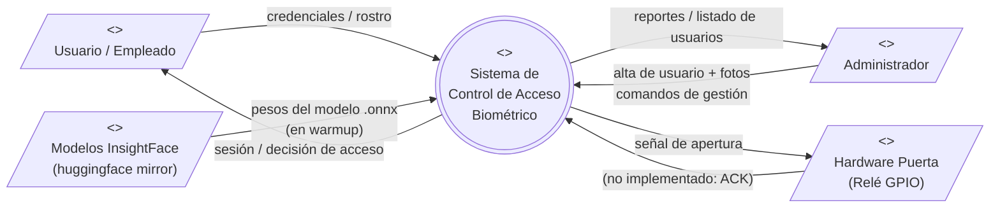
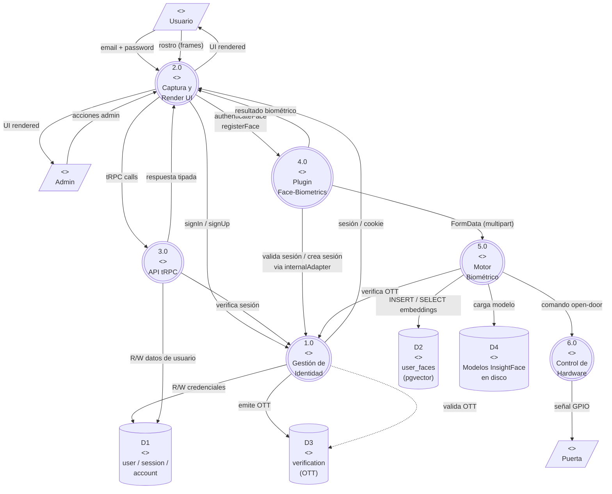
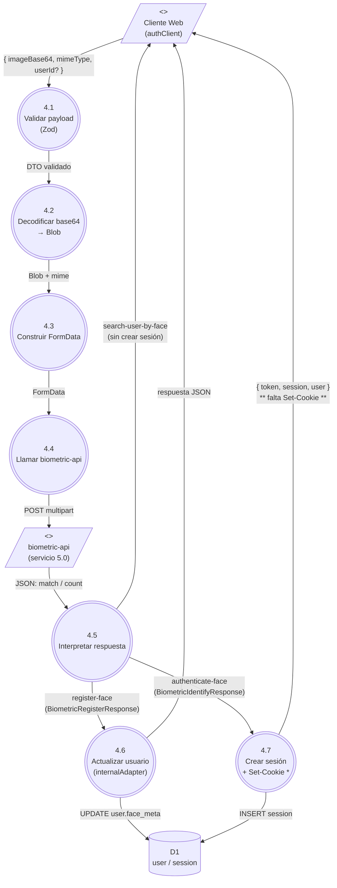
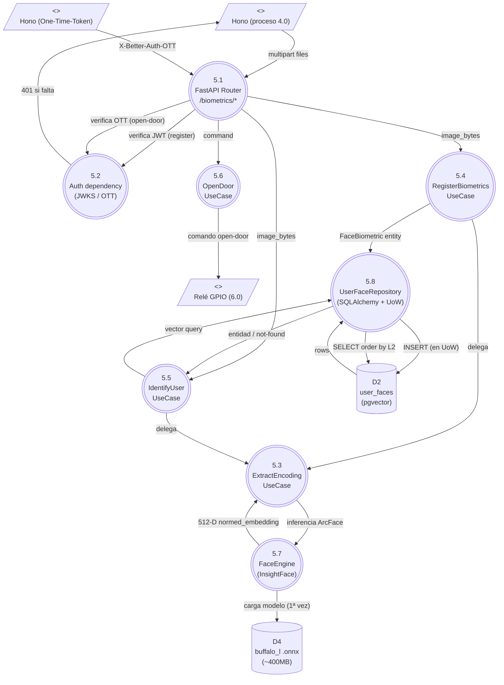

# Diagrama de Flujo de Datos (DFD) — Notación UML

Modela el sistema en términos de **procesos**, **almacenes de datos**, **entidades externas** y **flujos de datos**, siguiendo la metodología clásica de Yourdon/DeMarco adaptada a UML (estereotipos `<<process>>`, `<<datastore>>`, `<<external>>`).

Convenciones gráficas (Mermaid):

- `((nombre))` — proceso (círculo lógico)
- `[(nombre)]` — almacén de datos
- `[/nombre/]` — entidad externa
- Flechas etiquetadas — flujo de datos con el nombre del paquete que viaja

---

## DFD Nivel 0 (Contexto)

Vista de máxima abstracción: una sola caja "sistema" y todos los actores externos.

---

## DFD Nivel 1 (Descomposición de subsistemas)

El sistema se desglosa en sus procesos macro. Almacenes de datos visibles.

---

## DFD Nivel 2 — Expansión del proceso 4.0 (Plugin Face-Biometrics)

Desglose del subsistema más complejo: el puente entre Better-Auth (TS) y el servicio Python.

\* El proceso 4.7 actualmente NO emite la cabecera `Set-Cookie` — ver hallazgo #1 de `ARCHITECTURE.md`. Está representado como debería estar.

---

## DFD Nivel 2 — Expansión del proceso 5.0 (Motor Biométrico)

Detalle de la arquitectura hexagonal del `apps/biometric-api`.

---

## Tabla de flujos de datos (referencia)

Catálogo formal de cada flujo etiquetado en los diagramas.

| ID | Nombre | Origen | Destino | Estructura |
|----|--------|--------|---------|------------|
| F01 | Credenciales | Usuario | 1.0 Gestión Identidad | `{ email, password }` |
| F02 | Sesión + cookie | 1.0 | 2.0 UI | Set-Cookie httpOnly secure |
| F03 | tRPC request | 2.0 UI | 3.0 API tRPC | `{ procedure, input }` + cookie |
| F04 | tRPC response | 3.0 | 2.0 UI | JSON tipado vía `AppRouter` |
| F05 | imageBase64 (auth) | 2.0 UI | 4.0 Plugin | `{ imageBase64, mimeType? }` |
| F06 | imageBase64 (reg) | 2.0 UI | 4.0 Plugin | `{ imageBase64, mimeType?, userId }` |
| F07 | FormData multipart | 4.0 | 5.0 biometric-api | `multipart/form-data: file/files, user_id?` |
| F08 | IdentificationResponse | 5.0 | 4.0 | `{ match, user_id?, message }` |
| F09 | RegisterResponse | 5.0 | 4.0 | `{ status, count, message }` |
| F10 | UPDATE face_meta | 4.0 | D1 user | `{ faceRegistered, faceMeta }` |
| F11 | INSERT session | 4.0 / 1.0 | D1 session | `{ id, token, userId, expiresAt }` |
| F12 | embedding 512-D | 5.3 Extract | 5.4 / 5.5 | `Sequence[float]` |
| F13 | INSERT user_faces | 5.8 Repo | D2 user_faces | `FaceBiometric` mapeado a `UserFaceModel` |
| F14 | nearest neighbor query | 5.8 Repo | D2 user_faces | `SELECT … ORDER BY embedding <-> $1 LIMIT 1` |
| F15 | OTT | 1.0 | 5.2 Auth dep | Header `X-Better-Auth-One-Time-Token` |
| F16 | OTT verify | 5.2 | 1.0 | `POST /one-time-token/verify` |
| F17 | open-door signal | 5.6 | Relé | GPIO (no implementado) |
| F18 | warmup load | 5.7 | D4 modelos | Lectura de pesos `.onnx` |

---

## Trazabilidad: requisito → proceso → almacén

| Requisito funcional | Procesos involucrados | Almacenes tocados |
|---------------------|------------------------|--------------------|
| RF1: Registrar usuario con email/password | 1.0, 2.0 | D1 (user, account) |
| RF2: Iniciar sesión con email/password | 1.0, 2.0 | D1 (session) |
| RF3: Listar usuarios (admin) | 2.0, 3.0 | D1 (user) |
| RF4: Eliminar usuario (admin) | 2.0, 3.0 | D1 (user → CASCADE) |
| RF5: Registrar biometría de un usuario | 2.0, 4.0, 5.0 | D2 (user_faces), D1 (user.face_*) |
| RF6: Identificar usuario por rostro | 2.0, 4.0, 5.0 | D2, D1 (session) |
| RF7: Búsqueda de usuario por rostro (sin login) | 2.0, 4.0, 5.0 | D2, D1 (user) |
| RF8: Abrir puerta tras identificación | 1.0, 5.0, 6.0 | D3 (verification/OTT) |
| RF9: Verificar estado del API | 2.0, 3.0 | — |
