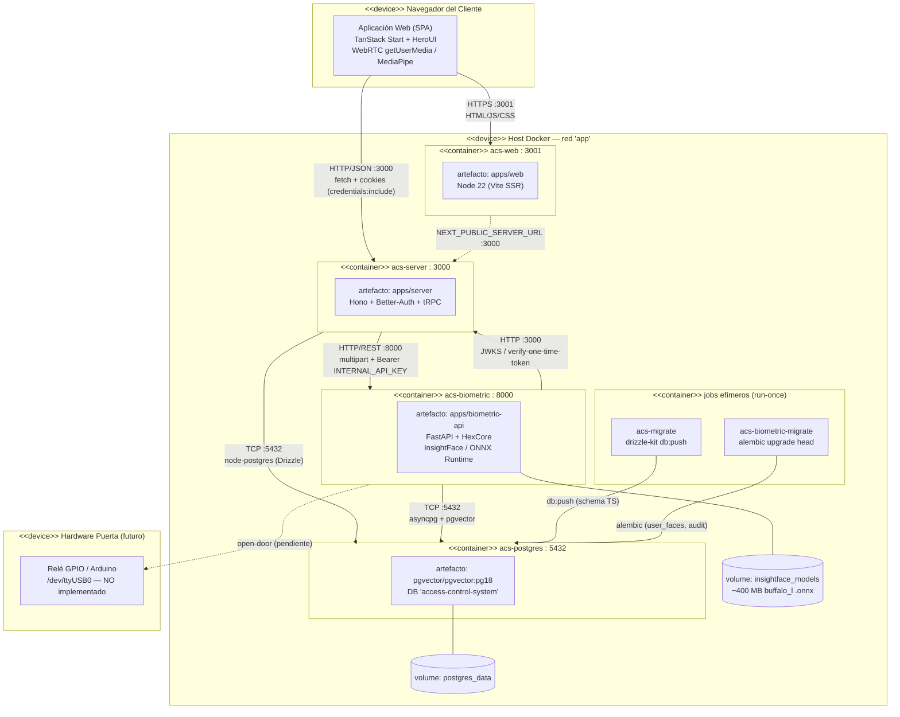

# Diagrama de Despliegue (UML Deployment)

Modela la topología física de ejecución: **nodos** (contenedores / dispositivos), los **artefactos** que se despliegan en cada uno y los **canales de comunicación** entre ellos. Refleja el `docker-compose` del proyecto (`docker-compose.yml` + `docker-compose.override.yml`).

Convenciones gráficas (Mermaid):

- `subgraph` con estereotipo `<<device>>` / `<<container>>` — nodo de ejecución
- Caja interna — artefacto desplegable (imagen / build)
- Flechas etiquetadas con el **protocolo** y **puerto** del canal de comunicación

---

## Vista general (Docker Compose)

---

## Catálogo de nodos

| Nodo (contenedor) | Imagen / Build | Puerto host→cont. | Artefacto desplegado | Dependencias de arranque |
|-------------------|----------------|-------------------|----------------------|--------------------------|
| `acs-web` | `Dockerfile.dev.web` (node:22) | `3001:3001` | `apps/web` (TanStack Start) | `server` healthy |
| `acs-server` | `Dockerfile.dev.server` (node:22) | `3000:3000` | `apps/server` (Hono) | `postgres` healthy, `acs-migrate` done |
| `acs-biometric` | `Dockerfile.dev.biometric` (python:3.14-slim) | `8000:8000` | `apps/biometric-api` (FastAPI) | `postgres` healthy, `acs-biometric-migrate` done, `server` healthy |
| `acs-postgres` | `pgvector/pgvector:pg18` | `5432:5432` | DB `access-control-system` | — (raíz) |
| `acs-migrate` | `node:22-alpine` | — (efímero) | `drizzle-kit push` | `postgres` healthy |
| `acs-biometric-migrate` | `python:3.14-slim` | — (efímero) | `alembic upgrade head` | `postgres` healthy, `acs-migrate` done |

## Canales de comunicación

| Origen | Destino | Protocolo / Puerto | Carga útil |
|--------|---------|--------------------|------------|
| Navegador | `acs-web` | HTTPS :3001 | Activos estáticos + SSR |
| Navegador | `acs-server` | HTTP/JSON :3000 (cookies) | Auth, tRPC, biometría base64 |
| `acs-server` | `acs-biometric` | HTTP/REST :8000 (`Bearer INTERNAL_API_KEY`) | `multipart/form-data` (imágenes), eventos de auditoría |
| `acs-biometric` | `acs-server` | HTTP :3000 | JWKS RS256, verificación de One-Time-Token |
| `acs-server` | `acs-postgres` | TCP :5432 (node-postgres) | SQL Drizzle (user/session/account/audit) |
| `acs-biometric` | `acs-postgres` | TCP :5432 (asyncpg) | SQL + pgvector (`user_faces`, `biometric_audit_log`) |

> **Nota:** En desarrollo local sin Docker los servicios corren en `localhost` (mismos puertos). El despliegue mostrado usa la red interna `app` de Docker Compose, donde los hostnames son los nombres de servicio (`postgres`, `server`, `biometric-api`).
