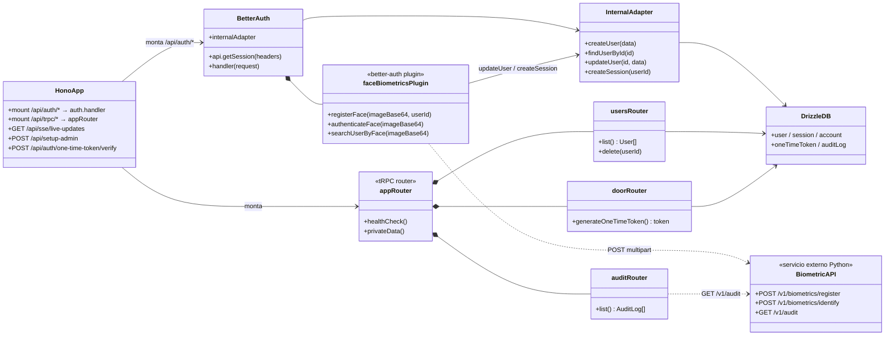

# Diagrama de Clases (UML Class)

Modela la estructura estática orientada a objetos del sistema. El peso recae en `apps/biometric-api`, que sigue **Arquitectura Hexagonal (HexCore)** con clases por capa; el `apps/server` (Hono) es predominantemente funcional, por lo que se representan sus routers/plugin como módulos colaboradores al final.

Convenciones: `<<interface>>` para puertos del dominio, herencia (`<|--`), realización de interfaz (`..|>`), dependencia/uso (`..>`).

---

## API Biométrica — capas Domain / Application / Infrastructure

```mermaid
classDiagram
    direction TB

    %% ===== HexCore (framework base) =====
    class BaseEntity {
        <<abstract>>
        +UUID id
        +datetime created_at
        +datetime updated_at
        +bool is_active
    }
    class IBaseRepository {
        <<interface>>
        +get_by_id(id) T
        +list_all() list~T~
        +save(entity) None
        +delete(id) None
    }
    class SQLAlchemyCommonImplementationsRepo {
        <<abstract>>
        +entity_cls
        +model_cls
        +not_found_exception
        +save(entity)
        +get_by_id(id)
    }
    class UseCase~T,R~ {
        <<abstract>>
        +execute(command: T) R
    }
    class QueryEntitiesUseCase~E~ {
        +execute(QueryRequestDTO) QueryResponseDTO
    }
    class IUnitOfWork {
        <<interface>>
        +commit()
        +rollback()
        +__aenter__()
        +__aexit__()
    }

    %% ===== DOMINIO: Biometrics =====
    class FaceBiometric {
        +str user_id
        +Sequence~float~ embedding
    }
    class IUserFaceRepository {
        <<interface>>
        +get_by_vector(embedding, threshold) FaceBiometric
    }
    class FaceBiometricNotFound {
        <<exception>>
    }

    %% ===== DOMINIO: Audit =====
    class BiometricAuditLog {
        +Optional~str~ user_id
        +str action
        +Optional~str~ ip_address
        +Optional~str~ user_agent
        +Dict details
    }
    class IBiometricAuditLogRepository {
        <<interface>>
    }
    class AuditLogNotFound {
        <<exception>>
    }

    %% ===== APLICACIÓN: Use Cases =====
    class FaceEngine {
        <<singleton>>
        -FaceAnalysis _instance
        +get_instance() FaceAnalysis
    }
    class WarmupBiometricsUseCase {
        +execute(WarmupCommand) str
    }
    class ExtractEncodingUseCase {
        +execute(ExtractEncodingCommand) Sequence~float~
    }
    class RegisterBiometricsUseCase {
        -IUserFaceRepository repo
        -IUnitOfWork uow
        +execute(RegisterBiometricsCommand) int
    }
    class IdentifyUserUseCase {
        -IUserFaceRepository repo
        +execute(IdentifyUserCommand) IdentificationResponse
    }
    class OpenDoorUseCase {
        +execute(OpenDoorCommand) OpenDoorResponse
    }
    class LogBiometricEventUseCase {
        -IBiometricAuditLogRepository repo
        -IUnitOfWork uow
        +execute(LogBiometricEventCommand) AuditLogResponse
    }
    class ListAuditLogsUseCase {
        +execute(QueryRequestDTO) QueryResponseDTO
    }

    %% ===== DTOs =====
    class RegisterBiometricsCommand {
        +str user_id
        +List~bytes~ images
    }
    class IdentifyUserCommand {
        +bytes image_bytes
        +float threshold
    }
    class IdentificationResponse {
        +Optional~str~ user_id
        +bool match
        +str message
    }
    class LogBiometricEventCommand {
        +str action
        +Optional~str~ user_id
        +Dict details
    }

    %% ===== INFRAESTRUCTURA: Repos + Models =====
    class UserFaceRepository {
        +entity_cls FaceBiometric
        +model_cls UserFaceModel
        +get_by_vector(embedding, threshold) FaceBiometric
    }
    class BiometricAuditLogRepository {
        +entity_cls BiometricAuditLog
        +model_cls BiometricAuditLogModel
    }
    class UserFaceModel {
        +String user_id
        +Vector(512) embedding
    }
    class BiometricAuditLogModel {
        +String action
        +JSON details
    }

    %% ===== Herencias / realizaciones =====
    BaseEntity <|-- FaceBiometric
    BaseEntity <|-- BiometricAuditLog
    IBaseRepository <|-- IUserFaceRepository
    IBaseRepository <|-- IBiometricAuditLogRepository

    SQLAlchemyCommonImplementationsRepo <|-- UserFaceRepository
    IUserFaceRepository <|.. UserFaceRepository
    SQLAlchemyCommonImplementationsRepo <|-- BiometricAuditLogRepository
    IBiometricAuditLogRepository <|.. BiometricAuditLogRepository

    UseCase <|-- WarmupBiometricsUseCase
    UseCase <|-- ExtractEncodingUseCase
    UseCase <|-- RegisterBiometricsUseCase
    UseCase <|-- IdentifyUserUseCase
    UseCase <|-- OpenDoorUseCase
    UseCase <|-- LogBiometricEventUseCase
    QueryEntitiesUseCase <|-- ListAuditLogsUseCase

    %% ===== Dependencias / colaboraciones =====
    RegisterBiometricsUseCase ..> IUserFaceRepository : usa
    RegisterBiometricsUseCase ..> IUnitOfWork : transacción
    RegisterBiometricsUseCase ..> ExtractEncodingUseCase : delega
    RegisterBiometricsUseCase ..> FaceBiometric : crea
    IdentifyUserUseCase ..> IUserFaceRepository : usa
    IdentifyUserUseCase ..> ExtractEncodingUseCase : delega
    IdentifyUserUseCase ..> IdentificationResponse : retorna
    IdentifyUserUseCase ..> FaceBiometricNotFound : captura
    ExtractEncodingUseCase ..> FaceEngine : inferencia
    LogBiometricEventUseCase ..> IBiometricAuditLogRepository : usa
    LogBiometricEventUseCase ..> BiometricAuditLog : crea

    UserFaceRepository ..> UserFaceModel : mapea
    UserFaceRepository ..> FaceBiometricNotFound : lanza
    BiometricAuditLogRepository ..> BiometricAuditLogModel : mapea

    RegisterBiometricsUseCase ..> RegisterBiometricsCommand
    IdentifyUserUseCase ..> IdentifyUserCommand
    LogBiometricEventUseCase ..> LogBiometricEventCommand
```

---

## Servidor (Hono) — módulos colaboradores

El `apps/server` no es OO clásico; se modela como módulos/funciones agrupadas y su relación con el plugin biométrico.

