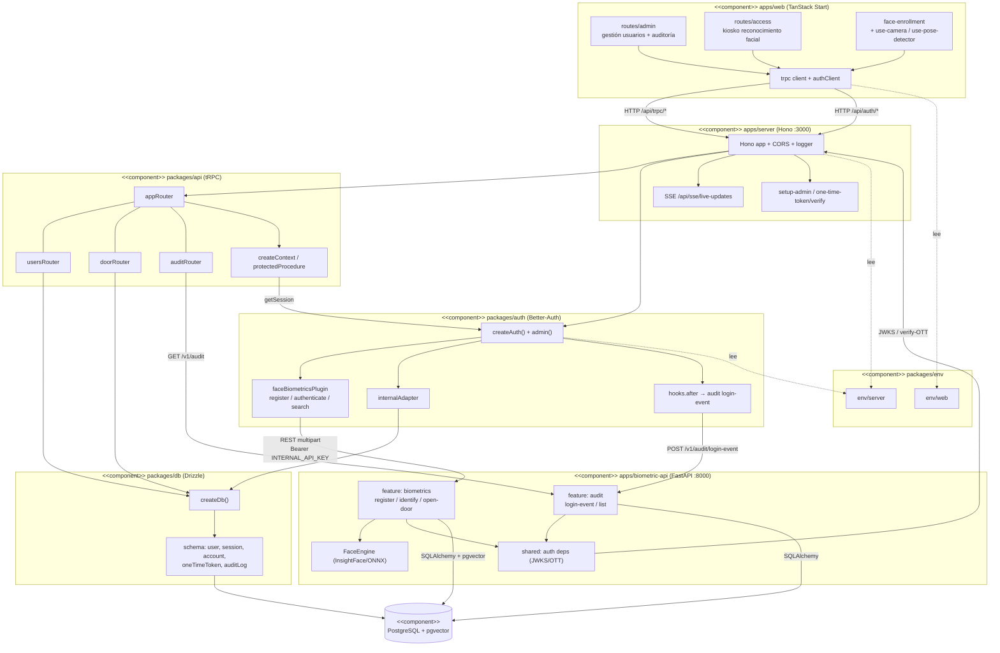

# Diagrama de Componentes (UML Component)

Modela las unidades de software desplegables y sus **interfaces provistas/requeridas** (puertos). Cada paquete del monorepo y cada feature de la API es un componente; las dependencias se expresan como conectores entre interfaces.

Convenciones (Mermaid): `subgraph` = componente compuesto, caja = componente/módulo, flecha etiquetada = interfaz consumida (lollipop lógico).

---

## Vista de componentes del sistema

---

## Interfaces principales (puertos)

| Componente | Interfaz **provista** | Interfaz **requerida** |
|------------|----------------------|------------------------|
| `apps/web` | — (cliente) | `/api/trpc/*`, `/api/auth/*` (HTTP+cookies) |
| `apps/server` (Hono) | `/api/auth/*`, `/api/trpc/*`, `/api/sse/*`, `/api/setup-*` | `getSession` (auth), `appRouter` (api) |
| `packages/api` | `appRouter` (tipado E2E) | `auth.api.getSession`, `createDb`, `BIOMETRIC_API_URL` |
| `packages/auth` | `auth.handler`, `internalAdapter`, plugin endpoints | `createDb`, REST biométrico, `env/server` |
| `packages/db` | `createDb`, `schema` | `DATABASE_URL` |
| `apps/biometric-api` | `/v1/biometrics/*`, `/v1/audit/*` | JWKS/OTT del server, PostgreSQL+pgvector |
| `packages/env` | `env/server`, `env/web` (validados) | `process.env` |

> **Tipado end-to-end:** `apps/web` importa solo el **tipo** `AppRouter` de `packages/api` (sin dependencia en tiempo de ejecución), lo que se representa como conector punteado de contrato, no de invocación directa.
