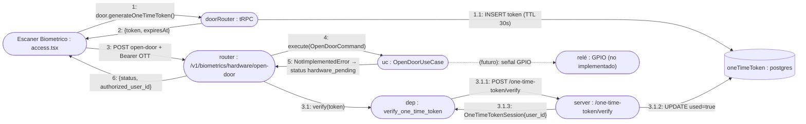

# Diagrama de Comunicación (UML Communication)

A diferencia del diagrama de secuencia, el **diagrama de comunicación** enfatiza la *estructura de enlaces* entre objetos y numera los mensajes según su orden de envío sobre esos enlaces. Mermaid no tiene un tipo nativo, por lo que se modela con un grafo de objetos y aristas etiquetadas `n: mensaje`.

Convención: `objeto : Clase` en cada nodo; etiqueta de arista `n: mensaje(args)` donde `n` es la secuencia. La sub-numeración (`2.1`) indica anidamiento dentro de una activación.

---

## CU-06 — Identificación facial + creación de sesión

Flujo más representativo: Web → Hono/plugin → API biométrica → pgvector → vuelta con sesión.

```mermaid
flowchart LR
    O_KIOSK(["Escaner Biometrico : access.tsx"])
    O_PLUGIN(["plugin : faceBiometricsPlugin"])
    O_ADAPTER(["adapter : internalAdapter"])
    O_API(["router : /v1/biometrics"])
    O_UC(["uc : IdentifyUserUseCase"])
    O_EXTRACT(["extract : ExtractEncodingUseCase"])
    O_ENGINE(["engine : FaceEngine (InsightFace)"])
    O_REPO(["repo : UserFaceRepository"])
    O_PG[("user_faces : pgvector")]
    O_AUDIT(["audit : /v1/audit/login-event"])

    O_KIOSK -->|"1: authenticateFace(imageBase64)"| O_PLUGIN
    O_PLUGIN -->|"2: POST /identify (FormData file)"| O_API
    O_API -->|"3: execute(IdentifyUserCommand)"| O_UC
    O_UC -->|"3.1: execute(image_bytes)"| O_EXTRACT
    O_EXTRACT -->|"3.1.1: get(image_bgr)"| O_ENGINE
    O_ENGINE -->|"3.1.2: normed_embedding 512-D"| O_EXTRACT
    O_UC -->|"3.2: get_by_vector(emb, 0.45)"| O_REPO
    O_REPO -->|"3.2.1: SELECT ORDER BY cosine_distance LIMIT 1"| O_PG
    O_PG -->|"3.2.2: fila / 0 filas"| O_REPO
    O_REPO -->|"3.3: FaceBiometric / FaceBiometricNotFound"| O_UC
    O_UC -->|"4: IdentificationResponse{match,user_id}"| O_API
    O_API -->|"4.1: log door/identify (decorator)"| O_AUDIT
    O_API -->|"5: {match, user_id, message}"| O_PLUGIN
    O_PLUGIN -->|"6: findUserById(user_id)"| O_ADAPTER
    O_PLUGIN -->|"7: createSession(user.id)"| O_ADAPTER
    O_ADAPTER -->|"7.1: INSERT session"| O_PG2[("session : postgres")]
    O_PLUGIN -->|"8: {token, session, user} + Set-Cookie"| O_KIOSK
```

---

## CU-05 — Registro de biometría (alta por admin)

```mermaid
flowchart LR
    O_ENROLL(["enrollment : face-enrollment.tsx"])
    O_PLUGIN(["plugin : faceBiometricsPlugin"])
    O_ADAPTER(["adapter : internalAdapter"])
    O_API(["router : /v1/biometrics/register"])
    O_UC(["uc : RegisterBiometricsUseCase"])
    O_EXTRACT(["extract : ExtractEncodingUseCase"])
    O_ENGINE(["engine : FaceEngine"])
    O_REPO(["repo : UserFaceRepository"])
    O_UOW(["uow : SqlAlchemyUnitOfWork"])
    O_PG[("user_faces : pgvector")]
    O_USER[("user : postgres")]

    O_ENROLL -->|"1: registerFace(imageBase64, userId)"| O_PLUGIN
    O_PLUGIN -->|"2: POST /register (FormData user_id, files)<br/>Bearer JWT admin"| O_API
    O_API -->|"3: execute(RegisterBiometricsCommand)"| O_UC
    O_UC -->|"3.1*: execute(image_bytes) [por cada imagen]"| O_EXTRACT
    O_EXTRACT -->|"3.1.1: get(image_bgr)"| O_ENGINE
    O_UC -->|"3.2*: save(FaceBiometric)"| O_REPO
    O_REPO -->|"3.2.1: INSERT (dentro de UoW)"| O_PG
    O_UC -->|"4: commit()"| O_UOW
    O_UOW -->|"4.1: COMMIT transacción"| O_PG
    O_UC -->|"5: count (int)"| O_API
    O_API -->|"6: {status, count}"| O_PLUGIN
    O_PLUGIN -->|"7: updateUser(userId, faceRegistered=true, faceMeta)"| O_ADAPTER
    O_ADAPTER -->|"7.1: UPDATE user"| O_USER
    O_PLUGIN -->|"8: {status, user, biometric}"| O_ENROLL
```

---

## CU-08 — Apertura de puerta con One-Time-Token

> `*` en CU-05 indica **iteración** (un envío por cada imagen capturada). En notación UML de comunicación equivale al prefijo `1..N:`.
