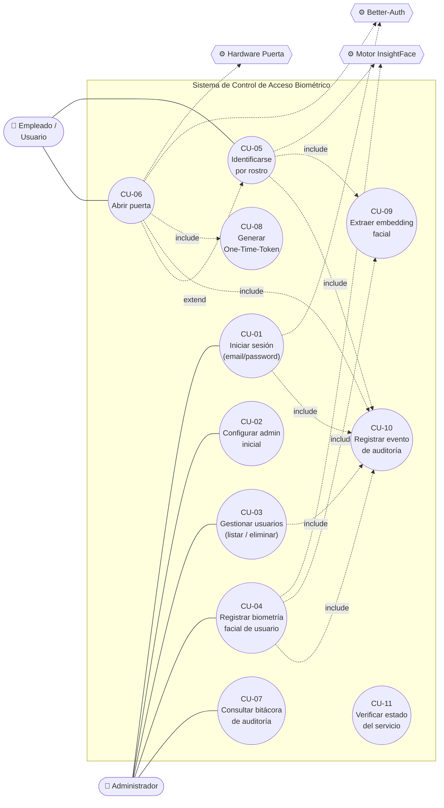

# Diagrama de Casos de Uso (UML Use Case)

Modela los **actores** y los **casos de uso** que el sistema ofrece, junto con las relaciones `<<include>>` (obligatoria) y `<<extend>>` (opcional). Mermaid no tiene tipo nativo de casos de uso; se aproxima con un grafo donde los óvalos `(( ))` son casos de uso y los actores se dibujan como nodos externos.

---

## Actores

| Actor | Descripción |
|-------|-------------|
| **Empleado / Usuario** | Se identifica por rostro para obtener acceso; no gestiona el sistema. |
| **Administrador** | Da de alta usuarios, registra su biometría, consulta auditoría y gestiona cuentas. |
| **Sistema Better-Auth** *(actor secundario)* | Emite/valida sesiones, JWT (JWKS) y One-Time-Tokens. |
| **Motor InsightFace** *(actor secundario)* | Provee la inferencia facial (detección + embedding ArcFace). |
| **Hardware Puerta** *(actor secundario)* | Relé/Arduino que ejecuta la apertura física (no implementado). |

---

## Diagrama

---

## Especificación resumida de casos de uso

| ID | Caso de uso | Actor primario | Precondición | Flujo principal | Endpoint(s) |
|----|-------------|----------------|--------------|-----------------|-------------|
| CU-01 | Iniciar sesión | Administrador | Cuenta existente | Valida credenciales → crea sesión → registra evento | `POST /api/auth/sign-in/email` |
| CU-02 | Configurar admin inicial | Administrador | Sin usuarios + secreto | Crea primer admin (run-once) | `POST /api/setup-admin` |
| CU-03 | Gestionar usuarios | Administrador | Sesión válida | Lista / elimina (admin no eliminable) | `users.list`, `users.delete` (tRPC) |
| CU-04 | Registrar biometría | Administrador | Usuario existe | Captura frames → extrae embeddings → guarda en pgvector → marca `faceRegistered` | `POST /api/auth/face-biometrics/register-face` → `POST /v1/biometrics/register` |
| CU-05 | Identificarse por rostro | Empleado | Biometría registrada | Captura rostro → embedding → búsqueda 1:N → crea sesión | `POST /api/auth/face-biometrics/authenticate-face` → `POST /v1/biometrics/identify` |
| CU-06 | Abrir puerta | Empleado | Identificación exitosa | Genera OTT → verifica → señal de apertura *(hardware pendiente)* | `door.generateOneTimeToken` → `POST /v1/biometrics/hardware/open-door` |
| CU-07 | Consultar auditoría | Administrador | Sesión válida | Lista bitácora paginada/filtrada | `audit.list` (tRPC) → `GET /v1/audit` |
| CU-08 | Generar One-Time-Token | Empleado *(incluido)* | Sesión válida | Crea token efímero (TTL 30s) | `door.generateOneTimeToken` (tRPC) |
| CU-09 | Extraer embedding | *(incluido)* | Imagen con rostro | Detección + ArcFace → vector 512-D | `ExtractEncodingUseCase` (interno) |
| CU-10 | Registrar evento auditoría | *(incluido)* | — | Persiste acción/IP/UA/detalles | `POST /v1/audit/login-event` + `@audit_endpoint` |
| CU-11 | Verificar estado | (monitoreo) | — | Healthcheck | `GET /health`, `healthCheck` (tRPC) |

> **Relaciones clave:** CU-04 y CU-05 *incluyen* CU-09 (extracción de embedding) — no hay registro ni identificación sin vectorizar el rostro. CU-06 *incluye* CU-08 (genera el OTT antes de abrir) y *extiende* a CU-05 (la apertura solo ocurre tras una identificación exitosa). La auditoría (CU-10) es transversal: la incluyen prácticamente todas las acciones sensibles vía el decorador `@audit_endpoint` y los hooks de Better-Auth.
