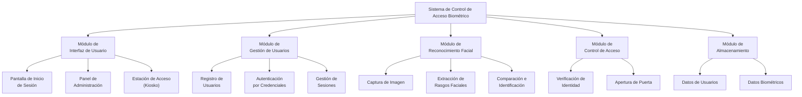

# Diagrama Morfológico

Descomposición del Sistema de Control de Acceso Biométrico en sus componentes principales.

## Descripción

| Módulo | Función |
|--------|---------|
| **Interfaz de Usuario** | Pantallas que ve el usuario final: inicio de sesión, panel administrativo y estación de acceso. |
| **Gestión de Usuarios** | Crea cuentas, valida credenciales y mantiene la sesión activa. |
| **Reconocimiento Facial** | Procesa la imagen del rostro y la compara contra los rostros registrados. |
| **Control de Acceso** | Decide si la persona está autorizada y, en su caso, ordena abrir la puerta. |
| **Almacenamiento** | Guarda de forma persistente la información de usuarios y las huellas biométricas. |
