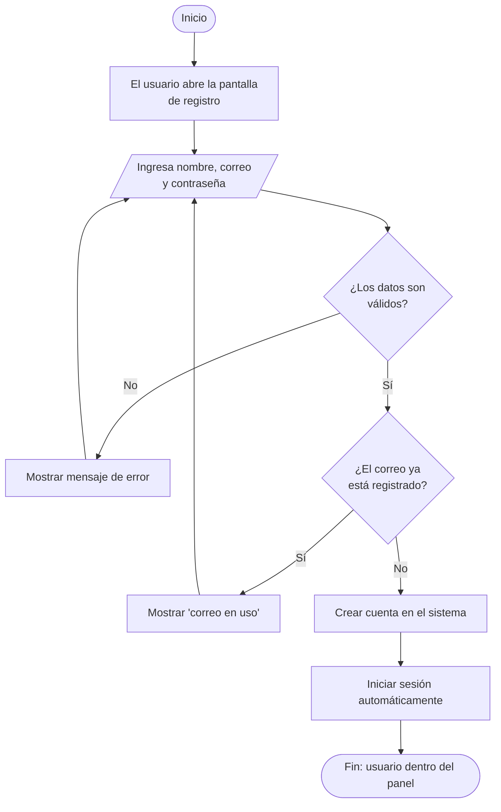
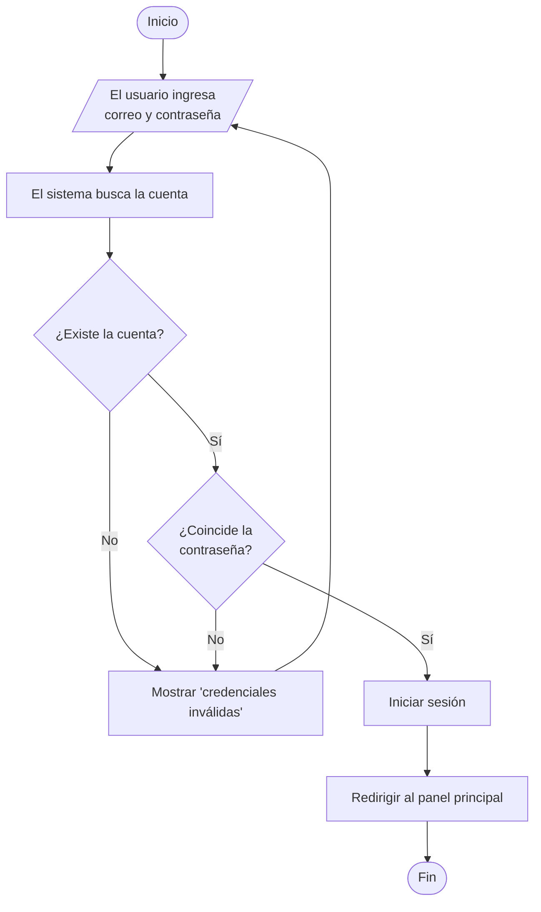
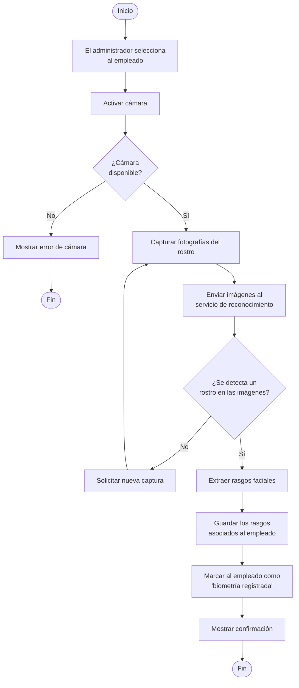
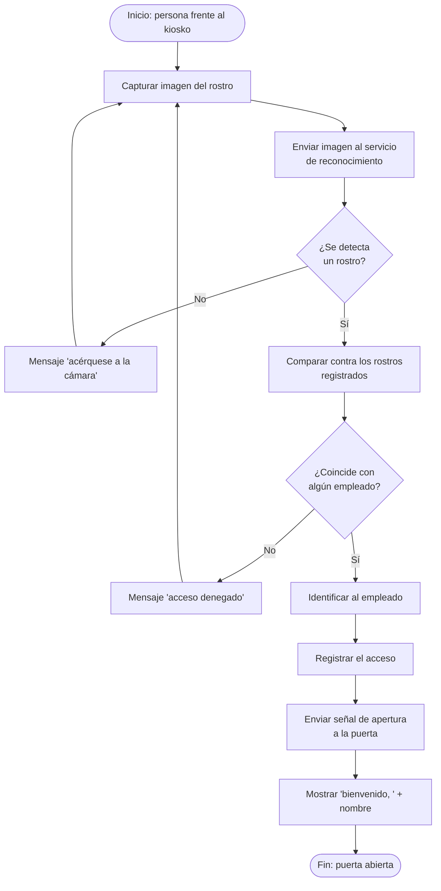
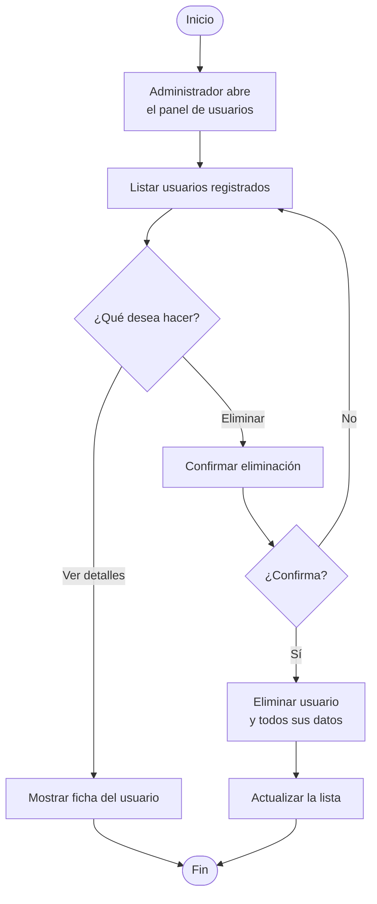

# Diagramas de Flujo

Procesos principales del sistema descritos paso a paso.

---

## Flujo 1 — Registro de un nuevo usuario

---

## Flujo 2 — Inicio de sesión con correo y contraseña

---

## Flujo 3 — Registro biométrico de un empleado

Realizado por un administrador para enrolar el rostro de un nuevo empleado.

---

## Flujo 4 — Identificación facial y acceso (estación de kiosko)

Flujo principal del sistema: el empleado se para frente al kiosko y pide acceso.

---

## Flujo 5 — Gestión de usuarios (administrador)

