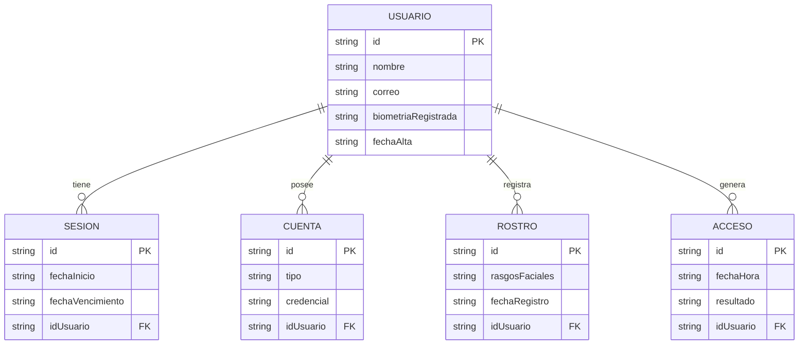

# Modelo Entidad–Relación (Vista General)

Vista conceptual de toda la información que almacena el sistema. Se muestran las entidades principales y cómo se relacionan entre sí.

## Explicación rápida

- **Usuario**: la persona registrada (empleado o administrador).
- **Cuenta**: forma en que el usuario inicia sesión. Hoy se usa correo + contraseña.
- **Sesión**: período en que el usuario está autenticado en el sistema.
- **Rostro**: representación matemática (numérica) del rostro del usuario. Un mismo usuario puede tener varias capturas para mayor precisión.
- **Acceso**: cada vez que alguien intenta entrar por el Escaner Biometrico se guarda un registro con la fecha, hora y resultado.

## Cardinalidades

| Relación | Lectura |
|----------|---------|
| Usuario — Sesión | Un usuario puede tener **muchas** sesiones a lo largo del tiempo. |
| Usuario — Cuenta | Un usuario puede tener **una o varias** cuentas (correo, redes sociales, etc.). |
| Usuario — Rostro | Un usuario puede tener **varios** rostros registrados (distintas fotos). |
| Usuario — Acceso | Un usuario produce **muchos** registros de acceso a lo largo del tiempo. |

## Atributos en lenguaje natural

El diagrama usa nombres cortos para compatibilidad con la herramienta. El significado completo está en el [Diccionario de Datos](05-diccionario-datos.md).

| Atributo del diagrama | Tipo real | Significado |
|----------------------|-----------|-------------|
| `biometriaRegistrada` | Sí / No | Indica si el usuario ya tiene su rostro enrolado |
| `fechaAlta` | Fecha | Cuándo se creó la cuenta |
| `rasgosFaciales` | Vector de 512 números | Descripción matemática del rostro |
| `resultado` | Texto | "permitido" o "denegado" |
| `idUsuario` | Clave foránea | Apunta al `id` del usuario dueño |
