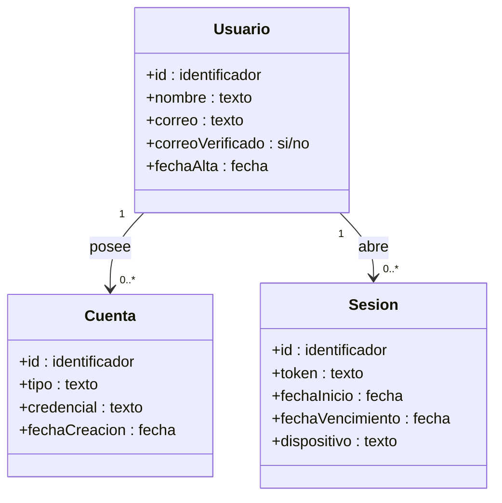
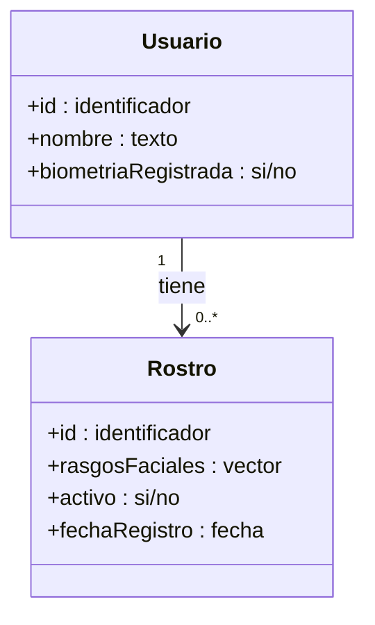
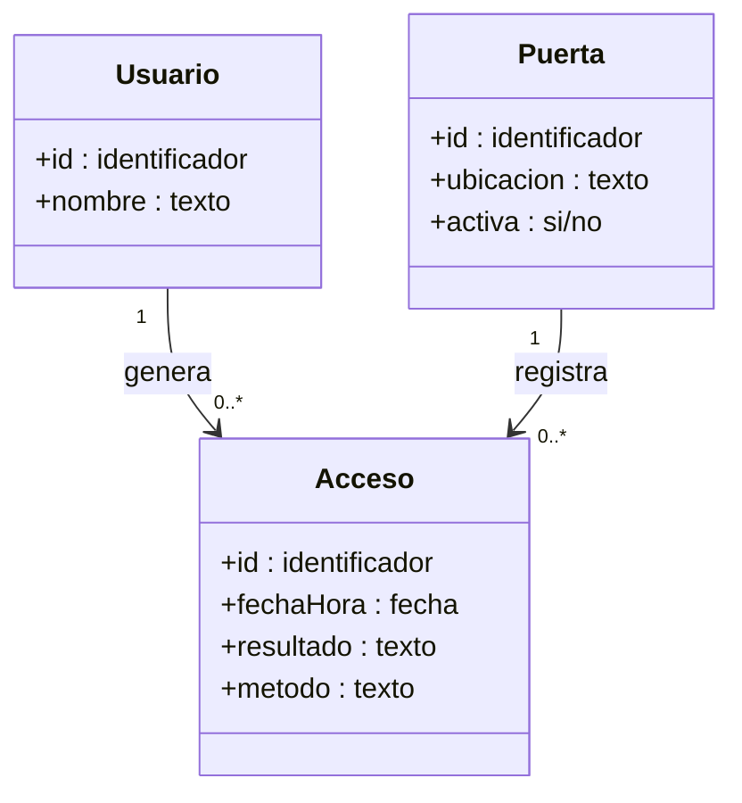

# Modelos Entidad–Relación Específicos

Vistas detalladas por **área funcional**. Permite explicar cada parte del sistema por separado.

---

## A) Área de Gestión de Identidad

Información de las personas y sus credenciales para iniciar sesión.

### Reglas principales

- Un **usuario** se identifica por su correo (único en el sistema).
- Una **cuenta** representa la forma en que el usuario inicia sesión. Hoy todas son del tipo "correo + contraseña".
- Una **sesión** dura un tiempo limitado y se renueva mientras el usuario use el sistema. Al cerrar sesión se elimina.

---

## B) Área de Biometría

Información generada por el sistema de reconocimiento facial.

### Reglas principales

- Un usuario puede no tener ningún rostro registrado (`biometriaRegistrada = no`) o tener **varias capturas** (recomendado: 3 a 5 fotos por persona).
- Los **rasgos faciales** se guardan como una secuencia de números (no como una foto). Esto preserva la privacidad: a partir de los números no se puede reconstruir la imagen original.
- Las capturas se pueden marcar como inactivas (`activo = no`) sin eliminarlas, para conservar histórico.

---

## C) Área de Control de Acceso (propuesta para etapas futuras)

### Notas

- Esta área queda **propuesta** como ampliación natural del sistema: hoy se identifica a la persona y se abre la puerta, pero todavía no se persisten todos los intentos de acceso.
- Permite generar reportes de auditoría: ¿quién entró ayer entre 8:00 y 9:00?, ¿qué empleados intentaron acceder sin éxito?, etc.
- El atributo `resultado` toma los valores `permitido` o `denegado`.
- El atributo `metodo` toma los valores `facial` o `credenciales`.

---

## Notación común a los tres diagramas

- `+` significa que el atributo es público (visible para el sistema).
- `"1"` y `"0..*"` indican la cardinalidad: cuántas instancias participan a cada lado de la relación.
- La flecha apunta desde el lado "uno" hacia el lado "muchos".
