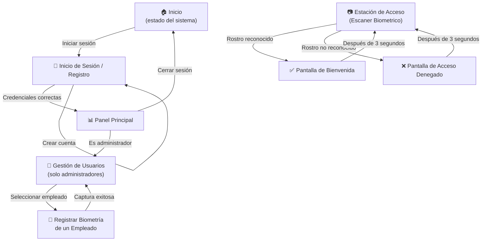

# Mapa de Navegación

Recorrido entre las distintas pantallas del sistema. Hay dos perfiles de uso:

- 🟢 **Usuario final / Administrador** — accede desde un computador o celular.
- 📷 **Estación de Escaner Biometrico** — dispositivo dedicado en la entrada, con cámara.

---

## Mapa General

---

## Pantallas por perfil

### Usuario administrativo (computador / celular)

| # | Pantalla | Función |
|---|----------|---------|
| 1 | Inicio | Bienvenida al sistema, indica si el servicio está disponible. |
| 2 | Inicio de sesión / Registro | Permite crear cuenta o ingresar con credenciales. |
| 3 | Panel principal | Resumen una vez que el usuario ya está dentro. |
| 4 | Gestión de usuarios | Lista de personas registradas, con opciones de ver y eliminar. |
| 5 | Registro biométrico | Captura las fotos de un empleado para enrolar su rostro. |

### Estación de Escaner Biometrico (dispositivo en la entrada)

| # | Pantalla | Función |
|---|----------|---------|
| 1 | Captura continua | La cámara está siempre activa esperando un rostro frente a ella. |
| 2 | Bienvenida | Muestra el nombre de la persona reconocida y abre la puerta. |
| 3 | Acceso denegado | Indica que no se pudo identificar a la persona. |

---

## Reglas de navegación

- Si el usuario **no ha iniciado sesión**, toda ruta protegida lo redirige a la pantalla de inicio de sesión.
- Si la sesión **expira**, el sistema vuelve automáticamente a la pantalla de inicio.
- La estación de **Escaner Biometrico** no requiere iniciar sesión: opera identificando al empleado por su rostro en tiempo real.
- Solo las cuentas con rol de **administrador** ven la opción de gestión de usuarios y registro biométrico.
