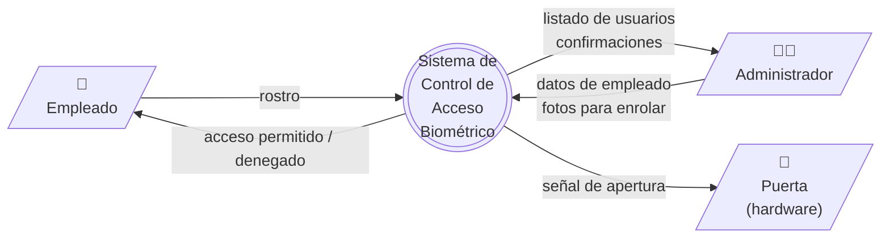
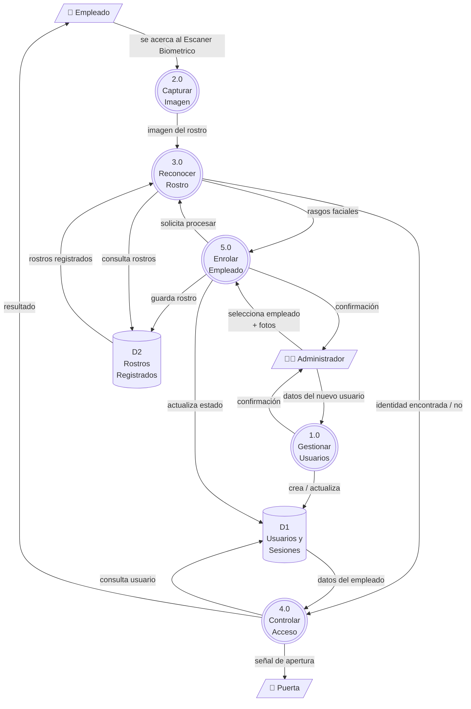

# Diagrama de Flujo de Datos (DFD)

Vista funcional del sistema: cómo circula la información entre los actores, los procesos y los almacenes de datos.

Notación utilizada:

- **Círculos** — procesos (acciones que realiza el sistema).
- **Cilindros** — almacenes de datos (información que queda guardada).
- **Rectángulos** — actores externos (personas u objetos físicos fuera del sistema).
- **Flechas** — flujos de información, etiquetadas con el dato que viaja.

---

## Nivel 0 — Diagrama de Contexto

Visión más simple posible: el sistema como una sola caja y sus actores externos.

### Lectura del diagrama

- El **empleado** se presenta frente al Escaner Biometrico y entrega su rostro. El sistema le responde abriendo o no la puerta.
- El **administrador** registra empleados y consulta información a través de su computador.
- La **puerta** recibe órdenes del sistema y se abre cuando corresponde.

---

## Nivel 1 — Descomposición funcional

El sistema se desglosa en sus procesos principales y se muestran los almacenes de datos.

### Procesos

| # | Proceso | Función |
|---|---------|---------|
| 1.0 | Gestionar Usuarios | Crear, listar y eliminar cuentas. |
| 2.0 | Capturar Imagen | Tomar la foto del rostro en el Escaner Biometrico o durante el enrolamiento. |
| 3.0 | Reconocer Rostro | Detectar el rostro en la imagen y extraer sus rasgos. Compararlos con los rostros registrados. |
| 4.0 | Controlar Acceso | Decidir si la persona puede entrar y dar la orden de apertura. |
| 5.0 | Enrolar Empleado | Registrar el rostro de un nuevo empleado en el sistema. |

### Almacenes de datos

| # | Almacén | Contenido |
|---|---------|-----------|
| D1 | Usuarios y Sesiones | Datos personales, credenciales y sesiones activas. |
| D2 | Rostros Registrados | Rasgos faciales numéricos de cada empleado enrolado. |

---

## Resumen ejecutivo

El sistema realiza, en esencia, tres tareas:

1. **Administrar quién está autorizado** (proceso 1.0 y 5.0).
2. **Reconocer a una persona por su rostro** en tiempo real (procesos 2.0 y 3.0).
3. **Permitir o denegar el acceso físico** según el reconocimiento (proceso 4.0).

Toda la información sensible (credenciales y rasgos faciales) se almacena de forma segura y los rostros se guardan como vectores numéricos, **nunca como fotografías**.
